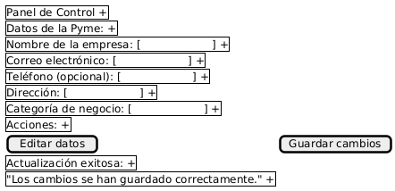
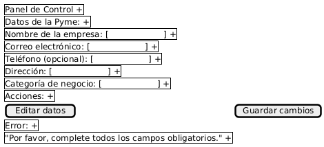
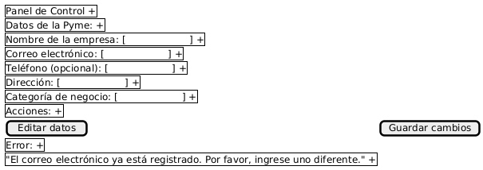
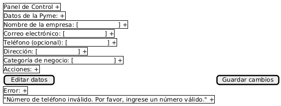
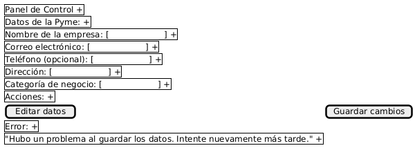

# Caso de Uso 01-02: Gestión de Perfil y Datos de la Pyme

---

## Descripción

Este caso de uso describe el proceso mediante el cual una Pyme, después de haberse registrado y verificado en la plataforma, puede gestionar su perfil y actualizar la información relacionada con la empresa. Esto incluye la edición de los datos esenciales como el nombre de la empresa, dirección, teléfono, categoría de negocio y otros datos relevantes. También permite al usuario configurar las preferencias de su cuenta y administrar los detalles relacionados con su presencia en línea.

---

## Actores

**Primarios:**
- **Representante de la Pyme**: Usuario que desea gestionar el perfil de la Pyme.

**Secundarios:**
- **Sistema de la Plataforma**: Proporciona la interfaz para editar y guardar los cambios.
- **Servicio de Envío de Correos (opcional)**: Enviar notificaciones sobre actualizaciones de perfil o cambios importantes.

---

## Precondiciones

- La Pyme debe haber completado el proceso de registro.
- La cuenta debe estar verificada.
- El usuario debe haber iniciado sesión en la plataforma.

---

## Postcondiciones

- Los datos del perfil de la Pyme son actualizados con éxito.
- Se envía una notificación por correo electrónico confirmando las modificaciones (si corresponde).

---

## Flujo Principal

1. **Acceso al perfil**: El usuario inicia sesión en su cuenta de Pyme y accede a su perfil desde el panel de control.
2. **Visualización de la información del perfil**: El sistema presenta los datos actuales de la Pyme, tales como:
   - Nombre de la empresa
   - Correo electrónico
   - Teléfono (opcional)
   - Dirección
   - Categoría de negocio
3. **Edición de datos**: El usuario puede modificar los siguientes campos:
   - Nombre de la empresa
   - Teléfono
   - Dirección
   - Categoría de negocio
   - Otras opciones según las funcionalidades de la plataforma
4. **Guardar cambios**: Después de realizar las modificaciones, el usuario hace clic en el botón "Guardar cambios" para enviar los datos al sistema.
5. **Validación de datos**: El sistema valida que los campos requeridos estén completos y que el correo electrónico sea único.
6. **Actualización exitosa**: Si la validación es exitosa, el sistema guarda los datos actualizados en la base de datos y notifica al usuario que los cambios han sido guardados correctamente.
7. **Notificación de cambios**: Si es necesario, el sistema envía un correo electrónico al usuario confirmando la actualización del perfil.

---

## Flujos Alternativos

### FA-01: Datos incompletos

1. El usuario no completa todos los campos obligatorios (por ejemplo, nombre de la empresa).
2. El sistema muestra un mensaje de error indicando que los campos obligatorios deben ser completados.

### FA-02: Correo electrónico ya registrado

1. El usuario intenta cambiar el correo electrónico a una dirección ya registrada en el sistema.
2. El sistema muestra un mensaje de error indicando que el correo electrónico ya está en uso y pide al usuario que ingrese uno diferente.

### FA-03: Error en la validación de datos

1. El sistema detecta que los datos proporcionados (por ejemplo, teléfono) no cumplen con el formato requerido.
2. El sistema muestra un mensaje de error detallado sobre el tipo de error (por ejemplo, "Número de teléfono inválido").
3. El usuario corrige el error y vuelve a intentar guardar los cambios.

### FA-04: Fallo al guardar los cambios

1. Si ocurre un problema al guardar los datos en la base de datos, el sistema informa al usuario con un mensaje de error genérico, pidiendo que intente nuevamente más tarde.

---

## Prototipos

1. Gestión de Perfil (Flujo Principal)    

2. Datos incompletos(FA-01)  

3. Correo electrónico ya registrado (FA-02)  

4. Error en la validación de datos (FA-03)  

5. Fallo al guardar los cambios (FA-04)  

---

## Requerimientos Especiales

- **Seguridad**: La plataforma debe asegurarse de que el correo electrónico y los datos de contacto estén correctamente validados para evitar registros falsos.
- **Notificación**: En caso de que el correo electrónico o los datos importantes del perfil sean modificados, el sistema debe enviar una notificación al usuario informándole de los cambios.
- **Accesibilidad**: El formulario de actualización de datos debe ser accesible y fácil de usar en dispositivos móviles y de escritorio.

---

## Escenarios de Prueba

| Entrada                                     | Salida Esperada                                         |
|---------------------------------------------|---------------------------------------------------------|
| Datos completos y válidos (nombre, email, teléfono) | Los datos del perfil se actualizan exitosamente. |
| Campos incompletos (falta el nombre de la empresa) | El sistema muestra un mensaje de error para completar los campos requeridos. |
| Correo electrónico ya registrado en el sistema | El sistema muestra un mensaje de error indicando que el correo ya está registrado. |
| Teléfono con formato incorrecto (ej. abcde) | El sistema muestra un mensaje de error: "Formato de teléfono inválido." |
| Modificación de dirección o teléfono | El sistema valida la nueva dirección o teléfono, y notifica que los cambios fueron guardados correctamente. |

---

#### Links de prototipos
Flujo Principal:
//www.plantuml.com/plantuml/dpng/jP2nIiH048RxVOgVmouOqBiKiJgrqKP4EqEACJk6m2ORPZSMvjAc5dqEdy8toPEuTm6jl4Ayd_aWy4_sWraxJ-8T6Qzw1VGHhfWq2pJ346uDUNgoKXEY8VIgZsvi_IYCLgpk2c-nFt4S3yWkEbUGvDWWmoLvBgryVf2RnlSS2jkvOzSPJzewj2I4nGkrvArRdCrzTBm_aSBszUkQIcvoFCn_GtDhnLVFuJFqkvsZLHAdANx9vk-ktPaC1zEFAqaFufflL5WHbc_NyZzSOR9fVCLvuragApcoay1fO1bO1PB0VLLs5OSTJEDRhWQrvaOxCluB

FA01:  
//www.plantuml.com/plantuml/dpng/ZP4zJWCn48NxFSLJAb0a3f0gA44q2AMWMwMOs4EmvFL4uua4X1o8WeeZxCNmxeQV0cdZolAdp_FqPfwDr395gmuLS9XYHOaZF6CXoLGYfiS21hOaazonI5YzD3mhS23tqcoKJuYRdNAc6MhyTzO_ra9KMS2HdMdxcOAJSUc1O_l-A4bm8JiN956y7BUMGTcvK8QS4OkCjwBj1y4pKhcxC1PiCAzT5uZpgPZwnWSZXUzwM-CDzUsUr9F2KRC9vUsFQNkAuPNwZE3dK1JwBNXo9_dRGcOyKSAs_ymBNDUZCseu6LzDEkbOpJdvVh5V

FA02:
//www.plantuml.com/plantuml/dpng/ZP6nQiCm48PtFyLFffQKF42cbCHqAnwwcGmNwMm4iYwSb498yp0TEtJg8_Z5AjSX7LfmD0bzVBgV_rOnaQP8FXMd0ZZDKL5W3yjOIqWg7lDp1YFRK98uC4-eZXqlCnp9itGxvGlYRgySQOaQ_vtjrLgBAWlOiqdQVmLdP5fwOTz_D184Tx8tJWBv-sbhuvIDSNd83R4eSIlQVn8i8-Hx7ZEXZUQZ6G9nl1HJbzObKjYXjotUK3yTI2qf37Kxbz-kPgag-jldhFGmVzl1aS0nzUzGRbrCIbOMg4JHqAle0rnebIFZ40JMDQmS4Yzcmx_dOiN1_gpw6m00

FA03:
//www.plantuml.com/plantuml/dpng/ZP6nJWCn38RtFeNL2LJ40tGgQYkswWQsKmStSQj8YLqvQILK-Z2C34nih7an4kuu5gGZK-GlN_BRMSI4cYBwDBbC02upQ939WoLO2YSL3xDh0HrROP9OcKTedWFDErZ8Hi9EgKSKZaeHvz32NsixM4jH9G7oP9Bc3tP6ngKdylbjBonm8qVZXD7VZbihfsICAu_y8nOcEeZcTwmDSTaRDnQiCnzC3KIn7qoxjYwXWgrpsy8Bj8ydL5ig1iFEbTfWhbL5V-SvtUJFG2erG1eQTdpEhzvPkOT65FPu5hqhrODI93WnS6_z79lM2w-J1R7z_kCl

FA04:
//www.plantuml.com/plantuml/dpng/ZP6nJiCm48RtFiMlJg1AVO1EHMq5BAW3MzNXOX-L9TiNdHqaLFemZ0nCF49UZ3Y9oe8KF9tywRix_rwdJ9eJ-Jmxpu3p0dkAx64P6ubPnMDnwS30jfGb5UO9-xV0gm9xyYIXKXuHXrevqGe7_7MELsiZgYnWpoPh-nsTaMdfcNtx-I9HS2ErSHB9tqvRMwTiZEk6_6CjodmIRR-eF2XsTJTcGXlCErCMuZG6SzXPbqbXIsv7lEDmtv1QKXWAbUlkhkPELVGtp_b3KmcQY5gbyXm8v74QPIzfQBd4OymSCoCs_4gXBqFxaP19BI_dfTzbjkPe-o_-0G00

---

**Documento Preparado Por:** [Luis Daniel Solano]  
**Fecha:** [01-04-2025]
