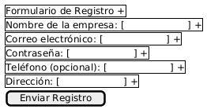
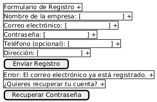
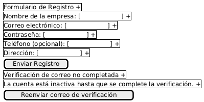
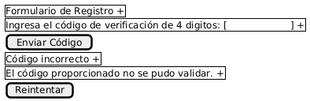

# Caso de Uso 01-03 :Registro y Verificación de la Pyme en la Plataforma

## Descripción

Este caso de uso describe el proceso mediante el cual una Pyme se registra en la plataforma de comercio electrónico, valida su autenticidad mediante un único código de 4 dígitos enviado por correo electrónico, y completa el proceso de activación de la cuenta.

---

## Actores

**Primarios:**

- Representante de la Pyme (Usuario que desea registrar la empresa)

**Secundarios:**

- Sistema de Validación
- Servicio de Envío de Correos

---

## Precondiciones

- El usuario accede al formulario de registro en la plataforma.
- El correo electrónico utilizado no debe estar previamente registrado en el sistema.

---

## Postcondiciones

- La cuenta de la Pyme se registra correctamente en el sistema.
- El usuario ha verificado su dirección de correo electrónico.
- La empresa ha sido validada como legítima.
- El usuario puede iniciar sesión y acceder a la gestión de su cuenta y productos.

---

## Flujo Principal

1. El usuario accede al formulario de registro disponible en la plataforma.
2. El sistema presenta los campos requeridos: nombre de la empresa, correo electrónico, contraseña, dirección. El campo de teléfono es opcional.
3. El usuario completa el formulario y envía la solicitud de registro.
4. El sistema verifica que el correo electrónico no esté registrado previamente.
5. El sistema envía un solo correo electrónico de verificación, que contiene: Un código de 4 dígitos para validar la autenticidad de la Pyme.
6. El usuario recibe el correo y debe ingresar el código de 4 dígitos recibido en el correo en el sistema.
7. El sistema valida el código de 4 dígitos y confirma la autenticidad de la Pyme.
8. Si la validación es exitosa, se completa el proceso de registro.
9. El usuario puede iniciar sesión y utilizar las funcionalidades asignadas a las PYMES dentro de la plataforma.

---

## Flujos Alternativos

### FA-01: Correo electrónico ya registrado

1. El usuario envía el formulario con un correo electrónico previamente registrado.
2. El sistema muestra un mensaje de error e impide continuar el registro.

### FA-02: Verificación por correo no completada

1. El usuario no accede al enlace de verificación.
2. La cuenta permanece inactiva.
3. El sistema ofrece la opción de reenviar el correo de verificación.

### FA-03: Fallo en la validación de la empresa

1. El sistema detecta inconsistencia o imposibilidad de validar la información proporcionada.
2. Se notifica al usuario con un mensaje que solicita corrección de datos.
3. El usuario puede editar los datos desde un enlace proporcionado.
4. El sistema reintenta la validación una vez se actualiza la información.

## Prototipos

1. Registro de pyme (Flujo Principal)    

2. Correo electrónico ya registrado (FA-01)  

3. Verificación por correo no completada (FA-02)  

4. Fallo en la validación de la empresa (FA-03)  

## Requerimientos Especiales  
## Seguridad:
- Contraseñas con mínimo 8 caracteres (1 mayúscula, 1 número, 1 símbolo).

## Experiencia de usuario:
- Progreso visual durante el registro (ej: "Paso 1 de 3").
- El sistema debe enviar un codigo de verificación único.

---

## Escenarios de Prueba

| Entrada | Salida Esperada |
|:--------|:----------------|
| Correo: `pyme@ejemplo.com` (ya registrado) | Error: *"El correo ya está registrado. ¿Quiere recuperar su cuenta?"* + enlace para restablecer contraseña. |
| Teléfono: `abcde` | Error: *"Ingrese un número válido (ej: +506 2552 1610)"* con ejemplo visual. |

---

#### Links de prototipos
Flujo Principal:
//www.plantuml.com/plantuml/dpng/ZP2zoi9G38RtSnKPlu_UWLF1dz51t4g7U1ebS7fISg9BwGKvYfVG6_DemKbeGxRtVKXuocIebZ2Ownr0Ny1EjBq6L1Pe20vquMGgK0mvdXfxQKzAxpGWKDif9Ln11R-cdi1ChKML12YGDnsVaRqiWQ8f9XeV2ouSAOptiqI1F-ayIyJmFqzjMCbxpX_DTFDMstXZrA-LsWskfDXy_Bq0

FA01:  
//www.plantuml.com/plantuml/dpng/ZP51IiGm68NtFSLRAWCUO3OEQ5qA3kvA5x_fhmJI_EKb4MIOmxXqAHv0i1UpMYY2GWtPlU-3bvTToiAS9EJgK0673QwCVGb2R-WKUttmATEmELR0J5nRVqVzIeD0-u6QP8i6Vvrs5YVhmaWrQ52NERv5x-m_KioKfEEhhCEt6iQNUuk64nkSjoZXTDswz5Jd_DHeXPrkKyT7BrnMQPTDQjAuHHtWVhyJJm9DUNm6Pr4wEriAVBpV5A_K1AehWrA8NE2AnYpdCzRib-Z796rrh7OQk-_l-mG0

FA02:
//www.plantuml.com/plantuml/dpng/ZL4xJiD04ErzYYb1aJW0LIG-5QA848tbObY_m4Zh7JExTXFbC9IKY2FuOYnUi42AbAosc_TvysOT4rkAx5ErguXsAxfLwmRF9aejQ8DdYScKLliyBeXxxPuCtrFFXAutHBwacWwzfX0pwqhDe0GFbspw3EBq5598nX7JnmaE3_3J-rQ3qfdsJZImFp_EkXQ3Sv8J7S7cNz-4KTYMLfgbaqUORCNnB4Gjo9LrSnYdNU-HkEN5yux93GY92J5DRoI1NPAHwONpFUXr04Ny4kUQnx_w5qMetW0bpuzPY_-ufjfNQuHsFkyN

FA03:
//www.plantuml.com/plantuml/dpng/RKynQiH03Ept5TCVf4gLwY1S8EsrneNOLOnW8ndjdXlZL_a9_bXiRqYQKoLcHZEQQwdajL2kOGx0VC67-VSZauiXCUuyIAbkk2m1Q8fF7PmBWJFYjYOPJkN4BbyIASgswW6yOgUaMdb3XsVJdwRDjhlf9EHuRuRzNzWl0D5exXphyKgZRl_vezje7iMKaa4DXJ4-zdMYB8dyfHrrTnQjh7ldFYpXofgEwZy0

---

**Documento Preparado Por:** [Mariano Duran Artavia y Luis Daniel Solano]  

**Ultima actualización:**  04/05/2025
