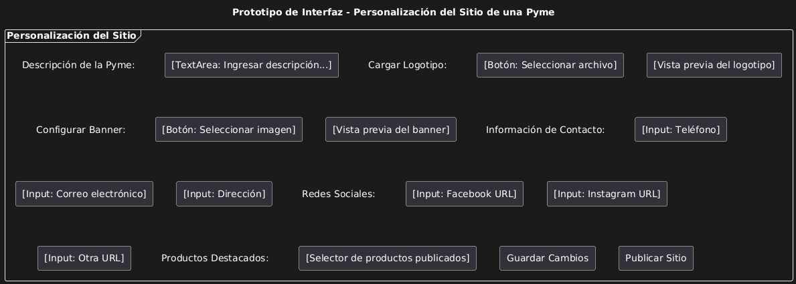
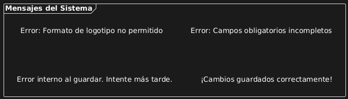

# Caso de uso 05-01-Personalización del Sitio de una Pyme
## Descripción

Este caso de uso describe el proceso mediante el cual una Pyme registrada en la plataforma puede personalizar su sitio dentro del sistema. Esto incluye descripción de pyme, carga de logotipo, configuración de imagen del banner, información de contacto, redes sociales y productos destacados. El objetivo es permitir que cada Pyme ofrezca una experiencia de marca coherente y diferenciada para sus clientes.

---

## Actores

**Primarios:**

- Vendedores (Pymes registrado con permisos para personalizar el sitio)

**Secundarios:**

- Sistema de Plataforma de Ventas

---

## Precondiciones

- La Pyme ha sido registrada, verificada y su cuenta está activa.
- El usuario ha iniciado sesión correctamente en la plataforma.

---

## Postcondiciones

- El sitio personalizado de la Pyme está disponible públicamente con los cambios aplicados.
- Los visitantes del sitio visualizan los elementos y productos definidos por la Pyme.

---

## Flujo Principal

1. El usuario inicia sesión en su cuenta de Pyme.
2. El usuario accede a la sección de "Personalización del Sitio".
3. El sistema muestra las opciones disponibles: selección de apartado de descripción de pyme, carga de logotipo, información de contacto y redes sociales, además de sus productos publicados.
4. El usuario selecciona una de las opciones presentes.
5. El usuario carga su logotipo.
6. El usuario completa los campos de información de la empresa y enlaces a redes sociales.
7. El usuario guarda los cambios.
8. El sistema almacena la configuración y genera una vista previa del sitio.
9. El usuario confirma la publicación del sitio personalizado.
10. El sistema actualiza el sitio público con la nueva información.

---

## Flujos Alternativos

### FA-01: Logotipo en formato no permitido

1. El usuario intenta subir un archivo que no cumple con los requisitos (formato o tamaño).
2. El sistema rechaza el archivo y muestra un mensaje con las especificaciones aceptadas.

### FA-02: Datos incompletos para publicación

1. El usuario guarda sin completar campos obligatorios.
2. El sistema impide la publicación y muestra un mensaje indicando los campos requeridos.

### FA-03: Error al guardar configuración

1. Se produce un error interno del sistema durante el guardado.
2. El sistema muestra un mensaje de error y recomienda intentar nuevamente más tarde.

#### Prototipos
##### Personalización de sitio

##### Errores

#### Requerimientos Especiales
- El logotipo debe ser una imagen en formato .png, .jpg, con un tamaño máximo de 2MB.
- La personalización debe ser responsive, es decir, los elementos deben adaptarse correctamente a dispositivos móviles y de escritorio.
- Las URLs de redes sociales deben validarse para asegurar que tengan formato correcto y pertenezcan a dominios válidos (Facebook, Instagram, entre otras).

#### Escenarios de Prueba
| Entrada                              | Salida Esperada                                   |
|--------------------------------------|--------------------------------------------------|
| Carga de logotipo en .png            | Logotipo aceptado y mostrado en la vista previa   |
| Carga de logotipo en .pdf	           | Error: "Formato de archivo no permitido"  |
| Guardado exitoso con todos los campos correctos   | Sitio actualizado y visible con diseño personalizado |

**Versión:** 2.0 
**Fecha de creación:** 26-04-2025  
**Úñtima actualización:** 01-05-2025  
**Documento Preparado Por:** Keylin Vega Morales 