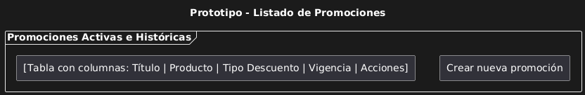
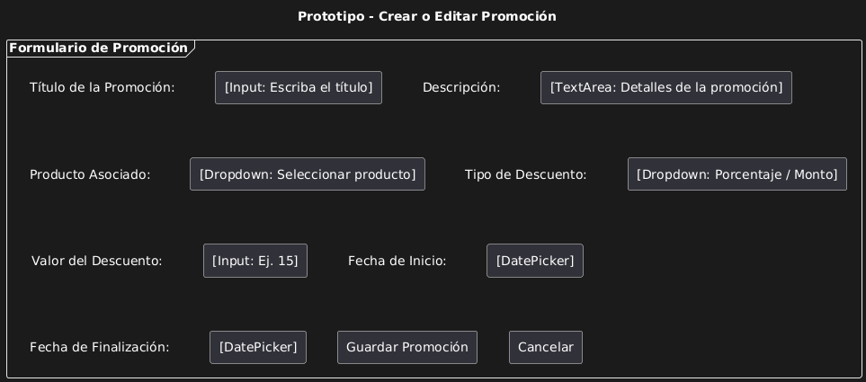
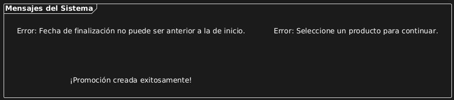

# Caso de Uso 05-01-Administración de Promociones

## Descripción

Este caso de uso describe el proceso mediante el cual una Pyme puede crear, editar y eliminar promociones desde su panel administrativo. Las promociones pueden incluir descuentos, ofertas por tiempo limitado, productos destacados, entre otros. El objetivo es brindar herramientas para atraer clientes y aumentar las ventas de forma dinámica.

---

## Actores

**Primarios:**

- Vendedores (Pymes registrado con permisos para personalizar el sitio)

**Secundarios:**

- Sistema de Plataforma de Ventas

---

## Precondiciones

- La Pyme debe de estar registrada en la plataforma.
- La cuenta se encuentra activa y verificada.
- La Pyme ha iniciado sesión en la plataforma.
- La Pyme tiene productos registrados.

---

## Postcondiciones

- La promoción queda activa y visible para los clientes según los parámetros definidos.
- Las promociones pueden ser modificadas o eliminadas en cualquier momento.

---

## Flujo Principal

1. El usuario accede al panel de administración de promociones.
2. El sistema muestra un listado de promociones activas e históricas.
3. El usuario selecciona "Crear nueva promoción".
4. El sistema presenta un formulario con los siguientes campos: título, descripción, producto asociado, tipo de descuento (porcentaje o monto), fecha de inicio y fecha de finalización.
5. El usuario completa el formulario y guarda la promoción.
6. El sistema valida los campos (fechas válidas, productos existentes, entre otros.).
7. Si los datos son correctos, la promoción se activa y se publica automáticamente en el sitio.
8. El usuario puede regresar al listado para editar o eliminar promociones en cualquier momento.

---

## Flujos Alternativos

### FA-01: Fechas inválidas

1. El usuario selecciona una fecha de finalización anterior a la de inicio.
2. El sistema muestra un mensaje de error y no permite guardar la promoción.

### FA-02: Producto no seleccionado

1. El usuario intenta crear una promoción sin asociar un producto.
2. El sistema solicita seleccionar un producto antes de continuar.

### FA-03: Acción de cancelar al elminar una promoción

1. El usuario selecciona la acción de eliminar una promoción activa.
2. El sistema solicita confirmación antes de realizar la eliminación.
3. El usuario presiona el botón de cancelar.

#### Prototipos
##### Listar

##### Agregar

##### Errores

#### Requerimientos Especiales
- El sistema debe validar que no se superpongan promociones con los mismos productos y fechas.

#### Escenarios de Prueba
| Entrada                              | Salida Esperada                                   |
|--------------------------------------|--------------------------------------------------|
| Selecciona la opción administración de promociones| El sistema muestra listado de promociones activas e históricas|
| Creación de promoción con 15% de descuento entre 01/05/2025 y 10/05/2025| Promoción publicada y visible en los productos seleccionados|
| Eliminación de promoción activa| Mensaje de confirmación antes de eliminar y promoción removida si se confirma||Edición de promoción|Promoción editada.|

**Versión:** 2.0  
**Fecha de creación:** 26-04-2025  
**Úñtima actualización:** 01-05-2025  
**Documento Preparado Por:** Keylin Vega Morales 
