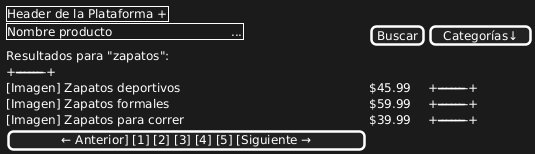
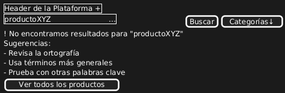
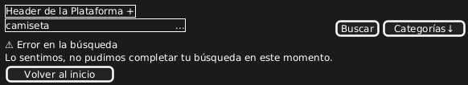

# Caso de Uso 08-01-Búsqueda de Productos

## Descripción

Este caso de uso permite a los compradores realizar búsquedas de productos mediante un campo de texto visible y accesible en todas las páginas relevantes de la plataforma. La funcionalidad permite a los usuarios encontrar productos específicos ingresando palabras clave y visualizar los resultados en tiempo real a medida que escriben.

#### Actores
- **Primarios**: Cliente
- **Secundarios**: Sistema

#### Precondiciones
- El cliente debe estar en una página relevante de la plataforma donde se encuentre el campo de búsqueda.
- El sistema debe de tener productos registrados en la plataforma.
- El sistema debe tener cargados productos con información relevante (nombre, categoría) para realizar la búsqueda.
- El cliente debe de estar registrado en la plataforma.

#### Postcondiciones
- El comprador ve una lista de productos que coinciden con la búsqueda en tiempo real.
- El sistema muestra sugerencias y resultados dinámicos conforme el comprador escribe las palabras clave.

#### Flujo Principal
1. El comprador accede a cualquier página relevante de la plataforma que tenga el campo de búsqueda visible.
2. El comprador ingresa una palabra clave o término relacionado con el producto que desea buscar.
3. El sistema actualiza los resultados de búsqueda.
4. El comprador selecciona un producto de la lista de resultados.
5. El sistema redirige al comprador a la página del producto seleccionado.

#### Flujos Alternativos
**FA-01: Búsqueda sin resultados**
1. El comprador ingresa un término que no tiene coincidencias.
2. El sistema muestra un mensaje indicando que no se encontraron productos y sugiere modificar la búsqueda.

**FA-02: Error en la búsqueda**
1. El sistema detecta un error técnico durante la búsqueda.
2. El sistema muestra un mensaje de error indicando que no se pudo realizar la búsqueda.

#### Prototipos

1. Campo de Búsqueda Básico (Flujo Principal)    

2. Búsqueda sin Resultados (FA-01)  

3. Error en la Búsqueda (FA-02)  

#### Requerimientos Especiales
- El sistema debe manejar los errores de búsqueda de manera clara y eficaz.
- Los resultados deben mostrar productos con coincidencias tanto en nombre como en categoría.

#### Escenarios de Prueba
| Entrada                              | Salida Esperada                                   |
|--------------------------------------|--------------------------------------------------|
| Término de búsqueda: "zapatos"       | Lista de productos que coinciden con "zapatos".   |
| Término de búsqueda: "camiseta"      | Lista de productos que coinciden con "camiseta".  |
| Término de búsqueda: "productoXYZ"   | Mensaje indicando que no se encontraron resultados. |

#### Links de prototipos
Flujo Principal:
//www.plantuml.com/plantuml/dpng/jP2nIiH048RxVOgVmouOqBiKiJgrqKP4EqEACJk6m2ORPZSMvjAc5dqEdy8toPEuTm6jl4Ayd_aWy4_sWraxJ-8T6Qzw1VGHhfWq2pJ346uDUNgoKXEY8VIgZsvi_IYCLgpk2c-nFt4S3yWkEbUGvDWWmoLvBgryVf2RnlSS2jkvOzSPJzewj2I4nGkrvArRdCrzTBm_aSBszUkQIcvoFCn_GtDhnLVFuJFqkvsZLHAdANx9vk-ktPaC1zEFAqaFufflL5WHbc_NyZzSOR9fVCLvuragApcoay1fO1bO1PB0VLLs5OSTJEDRhWQrvaOxCluB

FA01:  
//www.plantuml.com/plantuml/dpng/TP0nIWDX48Nx_nJFjC4Sm2feOoL1KTIGucLtiWJ-tGapisdYjbx04rXQU8gzYITnTqMmSM3WmRpXUxob1osSET8f0QSvheMb64f19bQPmPrQJSox1AJ9Sp0jsoBqyUaP_yrYiUYmlcoze6tmWZMk65AfzP_qhzUt3H9mXXk5D8KsOQpLOU9j3fQ3FD28sH_KREG3TsqbDlpiwHS9ECUj7FTEP48jj3Bk1iHqkNSY-W-hzuqwwlxTKKaZnYm-6LRMofOO-D0mZj3CxIYApAFy0DSFOWWTC-LXVnFv9dLfAKqvbVSD

FA02:
//www.plantuml.com/plantuml/dpng/ZP0nJWGn34NxdEBtY-OCAn0I1GKLpMWAanWKAOaNsw5PfkK2T5HSW0lGxats92XCGOiho_x_VUdlpKdTg7Wu1k2ummrJOaLY5C9T8QT7qKhOhI40lvf8DHixuRypJTEA-R9R95tmYXbNvFmaUleYEx-zBzZGvuzFNAkAWjk8VpXzstFdHDlxLc3SF5Un2pJ1eQUn8qez57PIUF_p30QRCwfKRYxJ1fdlfRomWWfoop7BCkvhs7DBeuSV

**Versión:** 1.0  
**Fecha de creación:** 25-04-2025  
**Úñtima actualización:** 25-04-2025  
**Documento Preparado Por:** Paula Chaves Rivera  