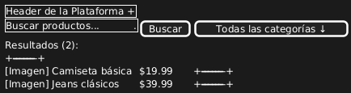
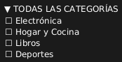
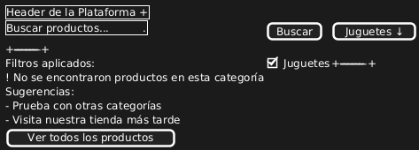

### Caso de Uso 09-01 Filtros por Categoría

#### Descripción
Este caso de uso permite al cliente filtrar productos por categoría utilizando un menú desplegable. Las categorías predefinidas incluyen ropa, tecnología, hogar, entre otras. Al seleccionar una categoría, el sistema actualiza la vista de productos para mostrar solo aquellos que pertenecen a la categoría seleccionada.

#### Actores
- **Primarios**: Cliente
- **Secundarios**: Sistema

#### Precondiciones
- El cliente debe de estar registrado en la plataforma.
- El cliente debe estar en la página de resultados de productos.
- El sistema debe de tener productos ya registrados. 
- El sistema debe tener productos organizados en categorías predefinidas.

#### Postcondiciones
- El sistema muestra únicamente los productos que pertenecen a la categoría seleccionada.
- El filtro aplicado se refleja correctamente en la vista sin necesidad de recargar la página.

#### Flujo Principal
1. El cliente accede a la página de productos.
2. El cliente selecciona una categoría desde el menú desplegable en la parte superior de la página.
3. El sistema actualiza los resultados dinámicamente para mostrar solo los productos de la categoría seleccionada.
4. El cliente visualiza los productos filtrados por la categoría seleccionada.
5. El sistema mantiene los productos filtrados hasta que el cliente cambie la categoría o restablezca el filtro.

#### Flujos Alternativos
**FA-01: Selección de múltiples categorías**
1. El cliente selecciona más de una categoría desde el menú desplegable.
2. El sistema actualiza los resultados para mostrar productos de las categorías seleccionadas simultáneamente.

**FA-02: No se encuentra ningún producto en la categoría seleccionada**
1. El cliente selecciona una categoría que no tiene productos disponibles.
2. El sistema muestra un mensaje indicando que no se encontraron productos en esa categoría.

#### Prototipos
1. Vista Principal con Filtros (Flujo Principal)

2. Filtrado por Categoría Combo Box (Flujo Principal)  

3. Categoría sin Productos (FA-02)

#### Requerimientos Especiales
- El filtro debe ser accesible tanto en dispositivos móviles como de escritorio.
- El sistema debe actualizar los resultados de manera dinámica sin recargar la página.

#### Escenarios de Prueba
| Entrada                                       | Salida Esperada                                         |
|-----------------------------------------------|--------------------------------------------------------|
| Selección de categoría: "Tecnología"          | Muestra productos de la categoría "Tecnología".        |
| Selección de categorías: "Ropa" y "Hogar"     | Muestra productos de las categorías "Ropa" y "Hogar".  |
| Selección de categoría sin resultados         | Muestra mensaje: "No se encontraron productos".        |

#### Links de prototipos

Flujo Principal:
//www.plantuml.com/plantuml/dpng/bSqnIiH05CRnVaxn5HPAS42jOhLeerOYTfBYS-QvB4moCk-bsgJr0fx00tYAlOadqTs8YiL2_jKmVFpUGet5bCdSsW7h2bV2A0LHa8ZRHEDJBYrHZGwO9XUz1XOybnpxO5czz_Z9ZmCUlXSDljwupv6AH4MWoJANpJiL7o-lpIJUYVR96BFYyFJeVFgiZlTNEMpnwvPBwHfSibsf6F6uUTDL8BODkyt1IUth6hyDy_aROQS8QOTdnL_-x1-FsQT6jv0kAfDz0W00

Combo box:
//www.plantuml.com/plantuml/dpng/SoWkIImgAKxCAU6gvb80WaVJzYY4-Biu1Ylu0B6pOuYhkt_GuLx7OB0iH0rOtOm92guvgSabHOStvsKc9w98UEId9nOfL2euvoTdvg5A-MGc5UKNemYvf1Ra5vMaGWHhmIHNBPT3QbuAs5q0

FA2: 
//www.plantuml.com/plantuml/dpng/ZP0nQZCn48LxdUBzzU8zW2lp5o6a28Q02HWNazN426IDcHbLjjjS82V80N8AtoGdYLY7h4aHyb2XullcIRCm9tMZxE4GW4E7MwR8YiZ8X6KcfsVH7Q4x1I2W4V-h3QJOgyGwk5ZVz_XEVpfY_KLiqEwugzlApeQFbzVDE0FTxFTq0KszITbL3BJFQQ0eDiTLZYEpVjnC1Jzp_6DLE_zmBp06bq6AAwcKwOFW0ZOd3EIy5Js_qyLwg5lMfYIoUG1cM6hb9qAR0N4bkp9i15R9aXDAPNCbUE8I2Rlpcy598mS0wnKhNA8OijZqZClomYaiccIK_HC0

**Versión:** 1.0  
**Fecha de creación:** 25-04-2025  
**Úñtima actualización:** 25-04-2025  
**Documento Preparado Por:** Paula Chaves Rivera  

