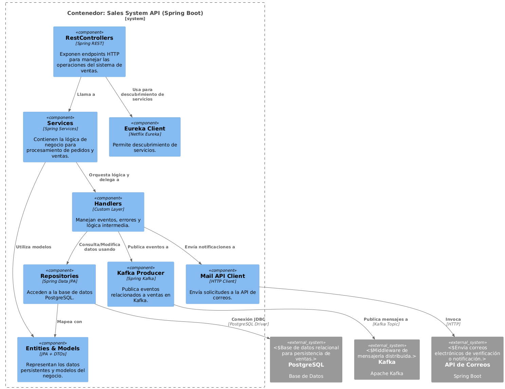

# Diagrama de componente API Correo

Este diagrama represente a los componentes del contenedor de la API del sistema.
## Vista previa del diagrama

## Notas

- El diagrama se genera dinámicamente desde PlantUML.
- Si se necesita una versión más detallada en PNG , se puede visualizar y descargar desde la misma carpeta.

**Documento realizado por Sofía Mora Badilla**
**Fecha de realización: 23/06/2025**