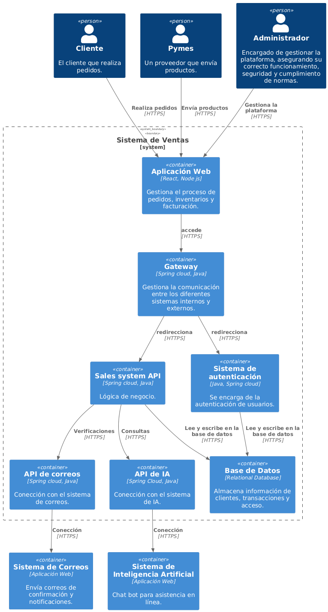

# Diagrama de contenedores

Este diagrama de contenedores representa la arquitectura del sistema, mostrando los diferentes contenedores que componen la aplicación, como servicios, bases de datos y interfaces de usuario, junto con las interacciones entre ellos. Ayuda a comprender cómo se distribuyen y comunican los componentes del sistema para cumplir con los requisitos funcionales.

## Vista previa del diagrama

## Notas

- El diagrama se genera dinámicamente desde PlantUML.
- Si se necesita una versión más detallada en PNG , se puede visualizar y descargar desde la misma carpeta. 

## Link del diagrama 

//www.plantuml.com/plantuml/png/fLJ1RXit4BthAwQ-n04K2mLwwYcAOhGkt4A8alGOp797QnPSSiiXxQf5FocdV89_h3FSh5RhhT82yS4IgVVcFJuEvoKdZ2ctRl6DzSRbck0kfOw_NwqYFbmrDjtbAZD54tmYdwvCQ5UTGw-S5vngPwlLvhiNMzrwz_FjgaLE56NhmqOOQ3t5gqxhBvx1QzfRRoEum80cXKYys5Bau2zDvXHQYakus3XBedKXNwyTc7u5lsU2IEZidmWTrROEV7NnVA1pxZfd2trxQ8cL_Cv35yCzKHrYePE_V_o8kbbdaoPyh5lhXRFMJyifef2A0symDhA2cg0XJZPuZE2aZCE4-n1RN08oDJcY5nXdC2564W7OPsyKt-eHmX8AojPOmm5CRiLn-QNKzbf9BPq6HGvOt52hhgqKwz0jTWVT-V0gP5zZF5poj-9pryEqqdifYNpn7FvQWFmzWqsvEes1M00EPk02FDxNvGDLwwxJECIYGMCVFtdubIeDv0sXIKlu9GZvjvBp3vzJ0NAQhI7M0msNj0JhxrKasi1oxhtGS-nhwccdoWqcUi23Lks_gS1Epzw0SI7NI_W9xt4Ywn1CQBC_EXMrIAN9QhkdA4lY8KS6AyleYnVwe_ywzy7eYFkWrO2kWCiIrjkRywPk7pyrrfHaFJN1s32lZJdTYIU1gVzHPBmKGGXWE8_MrVfBEDKi7WYez6TXENn2rCtCkIG_jz6YTRsud4YAoNybbEODVFw8Ke5CgIzOVzgY8tkkThFckTRD-aHcy_zbX3XNg35XXKp2VIKV2dkDAN3VjAw4ZKxt2aotrwv5Gnx1-lAGXzI6eSDBI14zep529cqPDDhVvPak_jQdkilLq5gBMRYpczsCwVxBsxek0se8iS_Jx-tHsG5yI7PVQEf7RSmZdYhU-4JEDkIDHLZ7GhVepZZOt662AYJeC29WELbXaWVt-D4JVfvGcgYQm3XCSlLQ7fqv6JSBmPtCzkDWUJETv2hzuzktsvqK5yOupaV6zMHupobbWe_uoNWOH_LJrW0VvuvUS4rFSSVVfuCXYlr8fWHnbZ9xx__DdQYSDFOjaOujDj5MLEu4eUgRNM7pL6RQNrLnPktf37bFSMpF6NM2FYLFdliN1QTZH4YSNSAPqWIcYo-gl2HVvzRz0m00

**Documento realizado por Luis Daniel Solano**
**Fecha de realización: 02/05/2025**