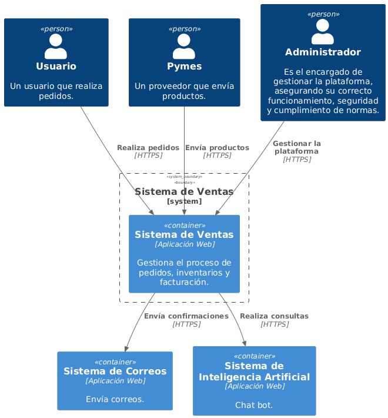

# Diagrama de contexto

Este diagrama de contexto muestra las interacciones entre el sistema de gestión de ventas para pymes y sus actores externos, como administradores, vendedores y clientes. Refleja el flujo de información esencial para la operación eficiente del sistema.

## Vista previa del diagrama

## Notas

- El diagrama se genera dinámicamente desde PlantUML.
- Si se necesita una versión más detallada en PNG , se puede visualizar y descargar desde la misma carpeta. 

## Link del diagrama 

//www.plantuml.com/plantuml/dpng/VPFFRXD13CRl-nGc5refJOJ4YLDBg4ebaAB-WMFbp3YffTcPnPuf2eXtwGjmuWtQ5yEJRT4cIiab6yU_Rxxvx3tMZ99B6vfN75qedk0svqxVJQU2toShphTbKPJ4fPWfvebBxRGB62jpfDa7NandRu_cjNJz-TEqHSqaLhgP6O4SIIPTrMzUmmTQScI1a1JGvIIapPn4KpoeHunXTAq5XTEeFaOe_I_uLWY4CF0FX8uy-wIJqU4pggNh0c_m-RebVO8xINT4Fia6ftZt-1jhqHUNjtZqBKTZJketQnOqg8gSAb0mqg6ih0QUO4MQEKKK22OMCECoIOjZGALL4OpMfWLS4Y4x1fObkjhVCiMSnh3fOeyUrk1AQxxxVnxkFJtSnwgriJPCopoesQAsscVJwp0qb-jQkNcVIlGewmDzOuOl-xPgz8kfeeuEuMS3zlatYmF5GDhJUuaQXDbowFZnJuIljAYbiwTxLpEMeIEjSJmFOmmSxoekdDHkjaINY_GA_Mr-DJisMkImpyMi9fTUid7QJz7rJIQzetf-ediqpsEcm2kow11E9FEIxIcySCRi5ZCiKkwDrq5SKC3D5ELvQyr17CobiOwd3TwEzs9xQQlynwkh-QL96pBOt6tiT6jPzt33xa6IWu3YagNTkAR_unRPhbkZjOICGn0gsRygksxFzhyJmrEFAVhIXhy0

**Documento realizado por Luis Daniel Solano**
**Fecha de actualización: 02/05/2025**