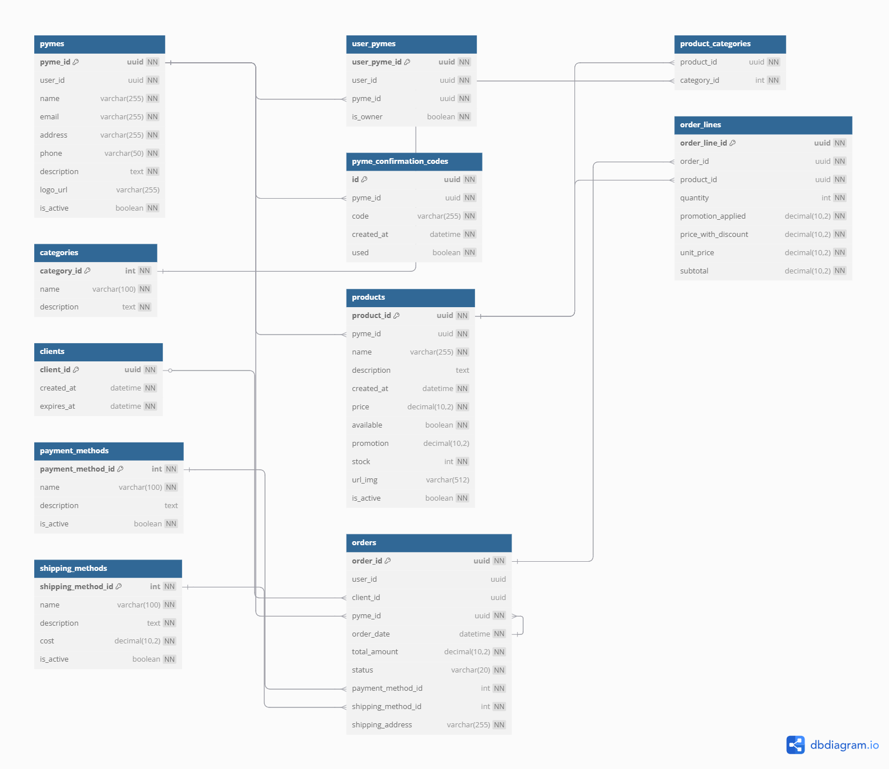
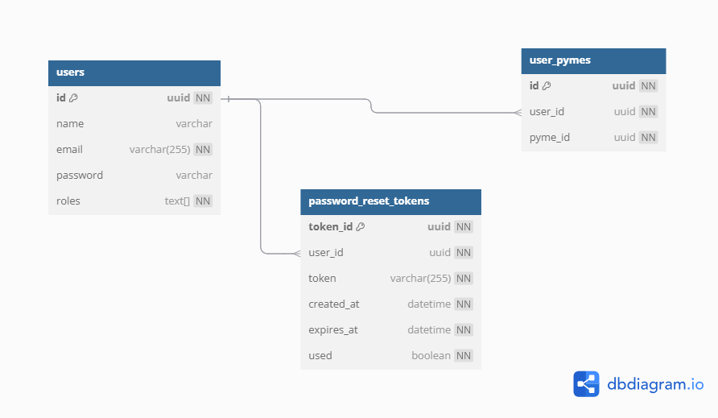
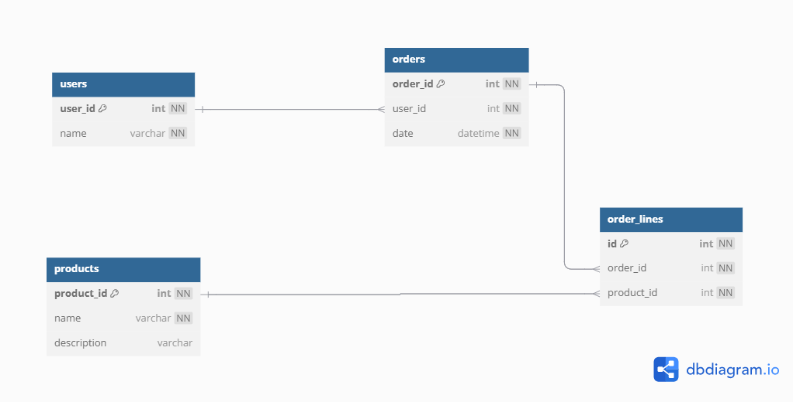

# Comunicación entre Microservicios

### **Relación entre Microservicios**

1. **Ventas_Service**  
    Se encarga de la gestión de productos, carritos de compra y pedidos de productos por parte de los usuarios cliente. Este servicio interactúa con el Email_Service para enviar formularios de compra a clientes y PYMEs. Además, se comunicará con **Auth_Service** para obtener la información del cliente autenticado (como el user_id) al momento de procesar un pedido, utilizando el token JWT que el cliente envía con cada solicitud. Ventas_Service puede decodificar este token para autenticar al usuario y asociar el pedido con el cliente correspondiente, sin necesidad de hacer una consulta adicional a **Auth_Service**.

2. **Auth_Service**  
    Este servicio se encarga de autenticar y autorizar a los usuarios en el sistema. Asegura que solo los usuarios válidos y registrados puedan realizar compras o acceder a ciertas funciones del sistema. Interactúa con **Ventas_Service** para validar la identidad del cliente a través de un token JWT y con **Email_Service** para verificar el registro de usuarios y gestionar la verificación de correo electrónico.
    Además, se encargará de disponer la información de usuarios y PYMES al **Ventas_Service** para cuando se requiera gestionar pedidos
    
3. **Recommendation_Service**  
   Se encarga de generar recomendaciones personalizadas de productos para los clientes mediante la utilización de reglas de asociación y análisis de contenido para sugerir productos basados en compras anteriores o descripciones similares. Ademas, reutiliza los datos de productos y órdenes registrados por el **Ventas_Service**.

# Descripción de las Tablas de las diferenes Bases de Datos

# 1. Servicio de Ventas

#### **Tabla de Productos (products)**

Guarda la información sobre los productos que venden las PYMEs.
        
#### Estructura de la tabla

| Atributo       | Tipo de Dato                                  | Descripción                                                    |
|----------------|-----------------------------------------------| -------------------------------------------------------------- |
| `product_id`   | UUID, PRIMARY KEY, NOT NULL                   | Identificador único del producto.                              |
| `pyme_id`      | UUID, FOREIGN KEY (`pymes.pyme_id`), NOT NULL | Referencia a la PYME que ofrece el producto.                   |
| `name`         | VARCHAR(255), NOT NULL                        | Nombre del producto.                                           |
| `description`  | TEXT, NOT NULL                                | Descripción detallada del producto.                            |
| `created_at`   | DATETIME, NOT NULL                            | Fecha de creación del producto.           |
| `price`        | DECIMAL(10,2), NOT NULL                       | Precio del producto.                                           |
| `available`    | BOOLEAN, NOT NULL                             | Indica si el producto está disponible para la venta.           |
| `promotion`    | DECIMAL(5,2), NULL                            | Porcentaje de promoción aplicado al producto, si aplica.       |
| `stock`        | INTEGER, NOT NULL                             | Cantidad disponible en inventario.                             |
| `url_img`      | VARCHAR(512), NULL                            | URL de la imagen del producto.                                 |
| `is_active`    | BOOLEAN, NOT NULL, DEFAULT `true`             | Indica si el producto está activo y visible para los usuarios. |

#### **Tabla de Categorías (categories)**

Define las categorías de productos.

#### Estructura de tabla

| Atributo      | Tipo de Dato                   | Descripción                          |
| ------------- | ------------------------------ | ------------------------------------ |
| `category_id` | INTEGER, PRIMARY KEY, NOT NULL | Identificador único de la categoría. |
| `name`        | VARCHAR(100), UNIQUE, NOT NULL | Nombre único de la categoría.        |
| `description` | TEXT, NOT NULL             | Descripción general de la categoría. |

#### **Tabla de Relación Productos-Categorías (product_categories)**

Establece la relación entre productos y categorías.  

#### Estructura de la tabla

| Atributo              | Tipo de Dato                                              | Descripción                                                    |
| --------------------- | --------------------------------------------------------- | -------------------------------------------------------------- |
| `product_id`          | UUID, FOREIGN KEY (`products.product_id`), NOT NULL       | Clave foránea que hace referencia al producto.                 |
| `category_id`         | INTEGER, FOREIGN KEY (`categories.category_id`), NOT NULL | Clave foránea que hace referencia a la categoría.              |

#### **Tabla de Métodos de Pago (payment_methods)**

Almacena los métodos de pago disponibles.

#### Estructura de tabla

| Atributo            | Tipo de Dato                   | Descripción                                  |
| ------------------- | ------------------------------ | -------------------------------------------- |
| `payment_method_id` | INTEGER, PRIMARY KEY, NOT NULL | Identificador único del método de pago.      |
| `name`              | VARCHAR(100), UNIQUE, NOT NULL | Nombre del método de pago.                   |
| `description`       | TEXT, NULL                     | Descripción del método de pago.              |
| `is_active`         | BOOLEAN, NOT NULL              | Indica si el método de pago está habilitado. |

#### **Tabla de Métodos de Envío (shipping_methods)**

Almacena los métodos de envío disponibles para las órdenes.

#### Estructura de la tabla

| Atributo            | Tipo de Dato                   | Descripción                                                  |
|---------------------|--------------------------------|--------------------------------------------------------------|
| `shipping_method_id`| INTEGER, PRIMARY KEY, NOT NULL | Identificador único del método de envío.                     |
| `name`              | VARCHAR(100), UNIQUE, NOT NULL | Nombre del método de envío (ej.: "Rápido", "Estándar").      |
| `description`       | TEXT, NOT NULL                 | Descripción del método.                                      |
| `cost`              | DECIMAL(10,2), NOT NULL        | Costo fijo del envío.                                        |
| `is_active`         | BOOLEAN, NOT NULL              | Indica si el método está habilitado para uso.                |

#### **Tabla de Pedidos (orders)**

Contiene los pedidos realizados por los clientes.

#### Estructura de la tabla

| Atributo             | Tipo de Dato        | Descripción                                                                      |
|----------------------| ------------------- |----------------------------------------------------------------------------------|
| `order_id`           | UUID                | Identificador único del pedido. Es la clave primaria.                            |
| `user_id`            | UUID (NULL)         | Clave foránea que referencia al usuario que hizo el pedido. Puede ser `NULL`.    |
| `client_id`          | UUID (NULL)         | Cliente anónimo (opcional).                                                      |
| `pyme_id`            | UUID                | Clave foránea que referencia a la pyme a la que se le compró.                    |
| `order_date`         | DATETIME            | Fecha y hora en la que se generó el pedido.                                      |
| `total_amount`       | DECIMAL(10,2)       | Monto total del pedido.                                                          |
| `status`             | VARCHAR(20)         | Estado del pedido: 'pending', 'processing', 'shipped', 'delivered', 'cancelled'. |
| `payment_method_id`  | INTEGER             | Clave foránea que referencia al método de pago usado.                            |
| `shipping_method_id` | INTEGER             | Clave foránea que referencia al método de envío seleccionado.                    |
| `shipping_address`   | VARCHAR(255)        | Dirección de envío proporcionada por el cliente.                                 |

#### **Tabla de Líneas de Pedido (order_lines)**

Desglosa los productos incluidos en un pedido.

#### Estructura de la tabla

| Atributo              | Tipo de Dato    | Descripción                                                         |
|-----------------------|-----------------|---------------------------------------------------------------------|
| `order_line_id`       | UUID            | Identificador único de la línea de pedido. Es la clave primaria.    |
| `order_id`            | UUID            | Clave foránea que referencia al pedido al que pertenece esta línea. |
| `product_id`          | UUID            | Clave foránea que referencia al producto incluido en el pedido.     |
| `quantity`            | INTEGER         | Cantidad de unidades del producto solicitadas.                      |
| `promotion_applied`   | DECIMAL(10,2)   | Monto de descuento aplicado.                                        |
| `price_with_discount` | DECIMAL(10,2)   | Precio total luego de aplicar descuento.                            |
| `unit_price`          | DECIMAL(10,2)   | Precio unitario del producto en el momento de realizar el pedido.   |
| `subtotal`            | DECIMAL(10,2)   | Subtotal de esta línea (quantity × unit_price).                     |

#### **Tabla de PYMEs (pymes)**

Almacena a las diferentes PYMES que ofrecerán sus productos en el sistema.

#### Estructura de la tabla

| Atributo        | Tipo de Dato                    | Descripción                                  |
|-----------------|---------------------------------|----------------------------------------------|
| `pyme_id`       | UUID, PRIMARY KEY, NOT NULL     | Identificador único de la PYME.              |
| `user_id`       | UUID, NOT NULL                  | Usuario que registró la PYME.                |
| `name`          | VARCHAR(255), UNIQUE, NOT NULL  | Nombre de la PYME.                           |
| `email`         | VARCHAR(255), UNIQUE, NOT NULL  | Correo electrónico único de la PYME.         |
| `address`       | VARCHAR(255), NOT NULL          | Dirección de la PYME.                        |
| `phone`         | VARCHAR(50), NOT NULL           | Teléfono de la PYME.                         |
| `description`   | TEXT, NOT NULL                  | Descripción breve de la PYME.                |
| `logo_url`      | VARCHAR(255), NULL              | URL del logo de la PYME.                     |
| `is_active`     | BOOLEAN, DEFAULT TRUE, NOT NULL | Estado de activación de la PYME.             |

#### **Tabla Relación N:M entre Usuarios y PYMEs (user_pymes)**

En el sistema, un usuario puede estar asociado con una única PYME, pero una PYME puede tener diferentes administradores, por lo que es necesario gestionar esta relación de manera eficiente. Esta tabla permite almacenar las relaciones entre los usuarios (admin_pyme) y las empresas a las que están asociados, permitiendo identificar quiénes son propietarios de cada PYME, si aplica.

#### Estructura de la tabla

| Atributo       | Tipo de Dato                                 | Descripción                                                    |
| -------------- | -------------------------------------------- | -------------------------------------------------------------- |
| `user_pyme_id` | UUID, PRIMARY KEY, NOT NULL                  | Identificador único de la relación entre el usuario y la PYME. |
| `user_id`      | UUID, NOT NULL                               | Referencia lógica al `user_id` del servicio de autenticación.  |
| `pyme_id`      | UUID, FOREIGN KEY (pymes.pyme\_id), NOT NULL | Clave foránea que hace referencia a la PYME.                   |
| `is_owner`     | BOOLEAN, DEFAULT FALSE, NOT NULL             | Indica si el usuario es propietario de la PYME.                |

#### **Tabla de Clientes Temporales (clients)**

Almacena la información de clientes anónimos o temporales que realizan pedidos sin registrarse en el sistema.

#### Estructura de la tabla

| Atributo    | Tipo de Dato                | Descripción                                            |
|-------------|-----------------------------|--------------------------------------------------------|
| `client_id` | UUID, PRIMARY KEY, NOT NULL | Identificador único del cliente temporal.              |
| `created_at`| DATETIME, NOT NULL          | Fecha y hora en que fue creado el cliente.             |
| `expires_at`| DATETIME, NOT NULL          | Fecha y hora en que expira la validez del cliente.     |

#### **Tabla de Códigos de Confirmación de PYME (pyme_confirmation_codes)**

Almacena los códigos únicos enviados por correo electrónico para confirmar el registro de una PYME.

#### Estructura de la tabla

| Atributo    | Tipo de Dato                                  | Descripción                                                  |
|-------------|-----------------------------------------------|--------------------------------------------------------------|
| `id`        | UUID, PRIMARY KEY, NOT NULL                   | Identificador único del código de confirmación.              |
| `pyme_id`   | UUID, FOREIGN KEY (`pymes.pyme_id`), NOT NULL | Clave foránea que referencia a la PYME asociada.             |
| `code`      | VARCHAR(255), NOT NULL                        | Código alfanumérico enviado por correo.                      |
| `created_at`| DATETIME, NOT NULL                            | Fecha y hora de creación del código.                         |
| `used`      | BOOLEAN, NOT NULL                             | Indica si el código ya fue utilizado para confirmar la PYME. |

#### **Modelo Entidad Relación**

# 2. Servicio de Autenticación

#### **Tabla de Usuarios (users)**

Almacena a los diferentes tipos de usuario que maneja el sistema.
#### Estructura de la tabla

| Atributo     | Tipo de Dato                     | Descripción                              |
|--------------|----------------------------------|------------------------------------------|
| `id`         | UUID, PRIMARY KEY, NOT NULL      | Identificador único del usuario.         |
| `name`       | VARCHAR                          | Nombre completo del usuario.             |
| `email`      | VARCHAR(255), UNIQUE, NOT NULL   | Correo electrónico único del usuario.    |
| `password`   | VARCHAR                          | Contraseña encriptada del usuario.       |
| `roles`      | TEXT[], NOT NULL                 | Lista de roles asignados.                |

#### Tokens de Recuperación de Contraseña (password_reset_tokens)

Almacena los tokens generados para el restablecimiento de contraseñas.

#### Estructura de la tabla

| Atributo       | Tipo de Dato                             | Descripción                                     |
|----------------|------------------------------------------|-------------------------------------------------|
| `token_id`     | UUID, PRIMARY KEY, NOT NULL              | Identificador único del token.                  |
| `user_id`      | UUID, FOREIGN KEY (`users.id`), NOT NULL | Referencia al usuario que solicita el cambio.   |
| `token`        | VARCHAR(255), UNIQUE, NOT NULL           | Token generado.                                 |
| `created_at`   | DATETIME, NOT NULL                       | Fecha de creación del token.                    |
| `expires_at`   | DATETIME, NOT NULL                       | Fecha de expiración del token.                  |
| `used`         | BOOLEAN, NOT NULL                        | Indica si el token ya fue utilizado.            |

#### Relación Usuarios–PYMEs (user_pymes)

Gestiona la relación entre usuarios y PYMEs que administran.

#### Estructura de la tabla

| Atributo   | Tipo de Dato                | Descripción                                                |
|------------|-----------------------------|------------------------------------------------------------|
| `id`       | UUID, PRIMARY KEY, NOT NULL | Identificador único de la relación.                        |
| `user_id`  | UUID, NOT NULL              | Referencia al usuario administrador.                       |
| `pyme_id`  | UUID, NOT NULL              | Referencia a la pyme asociada.                             |

#### **Modelo Entidad Relación**

### 3. Servicio de Recomendaciones

#### **Tabla de Productos (products)**

Contiene los productos disponibles en el sistema.

#### Estructura de la tabla

| Atributo     | Tipo de Dato                         | Descripción                                |
|--------------|--------------------------------------|--------------------------------------------|
| `product_id` | INTEGER, PRIMARY KEY, NOT NULL       | Identificador único del producto.          |
| `name`       | VARCHAR, NOT NULL                    | Nombre del producto.                       |
| `description`| VARCHAR (nullable)                   | Descripción del producto (usada en TF-IDF).|

#### **Tabla de Usuarios (users)**

Almacena los usuarios que han realizado pedidos y pueden recibir recomendaciones.

#### Estructura de la tabla

| Atributo     | Tipo de Dato                         | Descripción                                |
|--------------|--------------------------------------|--------------------------------------------|
| `user_id`    | INTEGER, PRIMARY KEY, NOT NULL       | Identificador único del usuario.           |
| `name`       | VARCHAR, NOT NULL                    | Nombre del usuario.                        |

#### **Tabla de Órdenes (orders)**

Registra las compras realizadas por los usuarios.

#### Estructura de la tabla

| Atributo     | Tipo de Dato                                     | Descripción                        |
|--------------|--------------------------------------------------|------------------------------------|
| `order_id`   | INTEGER, PRIMARY KEY, NOT NULL                   | Identificador único de la orden.   |
| `user_id`    | INTEGER, FOREIGN KEY (`users.user_id`), NOT NULL | Usuario que hizo la orden.         |
| `date`       | DATETIME, NOT NULL                               | Fecha y hora de la compra.         |

#### **Tabla de Líneas de Orden (order_lines)**

Asocia los productos con las órdenes, permite el análisis de patrones de compra.

#### Estructura de la tabla

| Atributo     | Tipo de Dato                                           | Descripción                      |
|--------------|--------------------------------------------------------|----------------------------------|
| `id`         | INTEGER, PRIMARY KEY, NOT NULL                         | Identificador único de la línea. |
| `order_id`   | INTEGER, FOREIGN KEY (`orders.order_id`), NOT NULL     | Referencia a la orden.           |
| `product_id` | INTEGER, FOREIGN KEY (`products.product_id`), NOT NULL | Producto comprado.               |

#### **Modelo Entidad Relación**

Enlace de modelos de entidad relación

Servicio de ventas:
https://dbdiagram.io/d/Modelo-ER-Servicio-Ventas-685e0bc7f413ba35081ef19f

Servicio de autenticación:
https://dbdiagram.io/d/Modelo-ER-Servicio-Autenticacion-685e0eeaf413ba35081f4257

Servicio de recomendaciones:
https://dbdiagram.io/d/Modelo-ER-Servicio-Recomendaciones-685e1166f413ba35081f89f6
