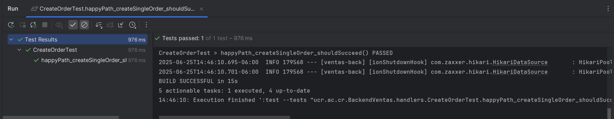
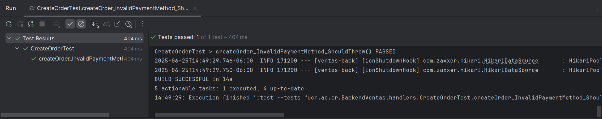
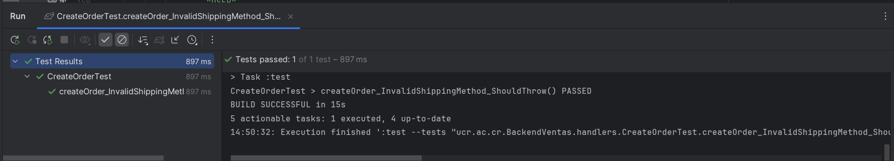
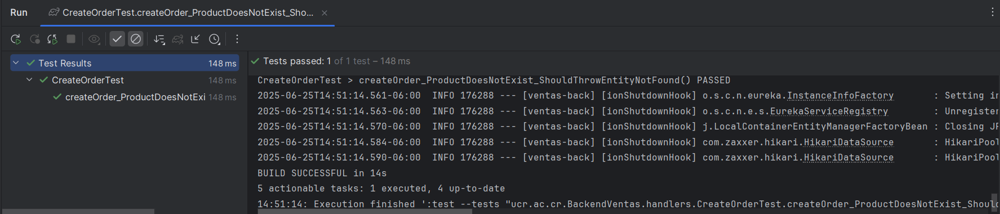
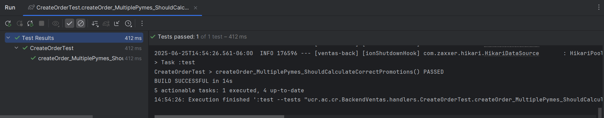
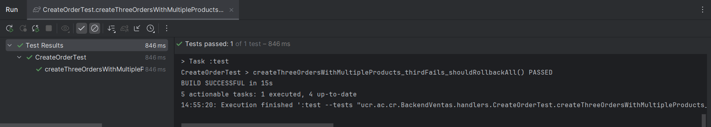

## Historias de Usuario: Proceso de Compra- Pruebas de Integracion


Este documento contiene los Casos de Prueba de Integración asociados a la historia de usuario “Proceso de compra”, que evalúa el correcto funcionamiento del flujo completo de creación de órdenes dentro del sistema.

Las pruebas cubren escenarios clave como:

Creación exitosa de órdenes simples y múltiples.

Validaciones de entrada (métodos inválidos, productos inexistentes).

Cálculo correcto de precios considerando promociones.

Rollbacks ante fallos para garantizar la integridad transaccional.

Cada test es ejecutado sobre el handler CreateOrderHandler y valida tanto los efectos observables (órdenes persistidas, totales calculados) como el manejo de errores esperados.

### Happy-Path con una Orden

| Campo                   | Detalle                                                                                                                                      |
| ----------------------- | -------------------------------------------------------------------------------------------------------------------------------------------- |
| **ID del Caso**         | CP-ORDER-001                                                                                                                                 |
| **Nombre del Test**     | `happyPath_createSingleOrder_shouldSucceed`                                                                                                  |
| **Tipo de Prueba**      | Integración                                                                                                                                  |
| **Módulo**              | Orden / Checkout                                                                                                                             |
| **Historia de Usuario** | Proceso de compra                                                                                                                            |
| **Descripción**         | Verifica la creación exitosa de una orden con un producto disponible, asegurando que el total calculado sea correcto.                        |
| **Producto Usado**      | Café Orgánico                                                                                                                                |
| **Cantidad**            | 3                                                                                                                                            |
| **Método de Envío**     | ENTREGA_LOCAL                                                                                                                                |
| **Método de Pago**      | EFECTIVO                                                                                                                                     |
| **Cliente**             | Anónimo (UUID generado)                                                                                                                      |
| **Pasos del Test**      | 1. Buscar el producto.<br>2. Crear el comando.<br>3. Ejecutar el handler.<br>4. Validar resultado.<br>5. Revisar DB.<br>6. Comparar totales. |
| **Resultado Esperado**  | Se crea una orden correctamente y se guarda en la base con el total exacto (`precio * cantidad`).                                            |
| **Resultado Obtenido**  | La orden fue creada y el total coincidió con el esperado.                                                                                    |
| **Estado**              | Aprobado                                                                                                                                     |

```java

@Test  
public void happyPath_createSingleOrder_shouldSucceed() {  
    Optional<ProductEntity> optional = productRepo.findByName("Café Orgánico");  
    // El segund parametro de assertTrue es un mensaje que se mostrará si la aserción falla  
    assertTrue(optional.isPresent(), "Product 'Café Orgánico' was not inserted");  
  
    ProductEntity product = optional.get();  
    int quantity = 3;  
    BigDecimal expectedTotal = product.getPrice().multiply(BigDecimal.valueOf(quantity));  
  
    CreateOrderHandler.Command command = new CreateOrderHandler.Command(  
            UUID.randomUUID(), // usuario anónimo  
            "CLIENT",  
            "alvarosiles499@gmail.com",  
            "Ana",  
            "Pérez",  
            "1234-0000",  
            "San José",  
            "EFECTIVO",  
            "ENTREGA_LOCAL",  
            List.of(new OrderProduct(product.getId(), quantity))  
    );  
  
    CreateOrderHandler.Result result = createOrderHandler.handle(command);  
  
    assertInstanceOf(CreateOrderHandler.Result.Success.class, result);  
  
    List<UUID> orderIds = ((CreateOrderHandler.Result.Success) result).orderIds();  
    assertEquals(1, orderIds.size(), "Solo se esperaba una orden");  
  
    var savedOrder = orderRepo.findById(orderIds.get(0));  
    assertTrue(savedOrder.isPresent(), "Orden no encontrada en la base de datos");  
  
    BigDecimal savedTotal = savedOrder.get().getTotalAmount();  
    assertEquals(0, savedTotal.compareTo(expectedTotal), "Total de la orden no coincide con el esperado");  
}

```





---

### Orden Inválida - Método de Pago Inválido

| Campo                   | Detalle                                                                                                                                                                                        |
| ----------------------- | ---------------------------------------------------------------------------------------------------------------------------------------------------------------------------------------------- |
| **ID del Caso**         | CP-ORDER-INVALID-001                                                                                                                                                                           |
| **Nombre del Test**     | `createOrder_InvalidPaymentMethod_ShouldThrow`                                                                                                                                                 |
| **Tipo de Prueba**      | Unitario                                                                                                                                                                                       |
| **Módulo**              | Orden / Checkout                                                                                                                                                                               |
| **Historia de Usuario** | Proceso de compra                                                                                                                                                                              |
| **Descripción**         | Valida que el sistema rechace un método de pago inválido y retorne una excepción controlada.                                                                                                   |
| **Producto Usado**      | Café Orgánico                                                                                                                                                                                  |
| **Cantidad**            | 3                                                                                                                                                                                              |
| **Método de Envío**     | ENTREGA_LOCAL                                                                                                                                                                                  |
| **Método de Pago**      | TRUEQUE (inválido)                                                                                                                                                                             |
| **Cliente**             | Registrado (UUID generado)                                                                                                                                                                     |
| **Pasos del Test**      | 1. Buscar el producto.<br>2. Crear el comando con método de pago inválido.<br>3. Ejecutar el handler.<br>4. Capturar la excepción lanzada.<br>5. Validar que el código sea `"INVALID_FORMAT"`. |
| **Resultado Esperado**  | Se lanza una `BaseException` con código `INVALID_FORMAT` debido a método de pago inválido.                                                                                                     |
| **Resultado Obtenido**  | Se lanzó la excepción esperada y el código fue `INVALID_FORMAT`.                                                                                                                               |
| **Estado**              | Aprobado                                                                                                                                                                                       |


```java

@Test  
void createOrder_InvalidPaymentMethod_ShouldThrow() {  
    Optional<ProductEntity> optional = productRepo.findByName("Café Orgánico");  
    assertTrue(optional.isPresent(), "Product 'Café Orgánico' was not inserted");  
    ProductEntity product = optional.get();  
  
  
    CreateOrderHandler.Command command = new CreateOrderHandler.Command(  
            UUID.randomUUID(), // usuario anónimo  
            "client@example.com",  
            "CLIENT",  
            "Ana",  
            "Pérez",  
            "1234-0000",  
            "San José",  
            "TRUEQUE", // Método de pago inválido  
            "ENTREGA_LOCAL",  
            List.of(new OrderProduct(product.getId(), 3))  
    );  
  
    BaseException ex = assertThrows(  
            BaseException.class,  
            () -> createOrderHandler.handle(command),  
            "Expected BaseException due to invalid payment method");  
  
    assertEquals("INVALID_FORMAT", ex.getCode());  
}

```





---


### Orden Inválida - Método de Envío Inválido

| Campo                   | Detalle                                                                                                                                                                                   |
| ----------------------- | ----------------------------------------------------------------------------------------------------------------------------------------------------------------------------------------- |
| **ID del Caso**         | CP-ORDER-INVALID-002                                                                                                                                                                      |
| **Nombre del Test**     | `createOrder_InvalidShippingMethod_ShouldThrow`                                                                                                                                           |
| **Tipo de Prueba**      | Unitario                                                                                                                                                                                  |
| **Módulo**              | Orden / Checkout                                                                                                                                                                          |
| **Historia de Usuario** | Proceso de compra                                                                                                                                                                         |
| **Descripción**         | Verifica que se lance una excepción controlada cuando se usa un método de envío inválido.                                                                                                 |
| **Producto Usado**      | Café Orgánico                                                                                                                                                                             |
| **Cantidad**            | 3                                                                                                                                                                                         |
| **Método de Envío**     | ENTREGA_DRON (inválido)                                                                                                                                                                   |
| **Método de Pago**      | EFECTIVO                                                                                                                                                                                  |
| **Cliente**             | Registrado (UUID generado)                                                                                                                                                                |
| **Pasos del Test**      | 1. Buscar el producto.<br>2. Crear el comando con método de envío inválido.<br>3. Ejecutar el handler.<br>4. Capturar la excepción.<br>5. Verificar que el código sea `"INVALID_FORMAT"`. |
| **Resultado Esperado**  | Se lanza una `BaseException` con código `INVALID_FORMAT` debido al método de envío inválido.                                                                                              |
| **Resultado Obtenido**  | Se lanzó la excepción esperada y el código fue `INVALID_FORMAT`.                                                                                                                          |
| **Estado**              | Aprobado                                                                                                                                                                                  |

```java
@Test  
void createOrder_InvalidShippingMethod_ShouldThrow() {  
    Optional<ProductEntity> optional = productRepo.findByName("Café Orgánico");  
    assertTrue(optional.isPresent(), "Product 'Café Orgánico' was not inserted");  
    ProductEntity product = optional.get();  
  
    CreateOrderHandler.Command command = new CreateOrderHandler.Command(  
            UUID.randomUUID(), // usuario anónimo  
            "CLIENT",  
            "client@example.com",  
            "Ana",  
            "Pérez",  
            "1234-0000",  
            "San José",  
            "EFECTIVO",  
            "ENTREGA_DRON", // Método de envío inválido  
            List.of(new OrderProduct(product.getId(), 3))  
    );  
  
    BaseException ex = assertThrows(  
            BaseException.class,  
            () -> createOrderHandler.handle(command),  
            "Espera un BaseException de método de envío incorrecto");  
  
    assertEquals("INVALID_FORMAT", ex.getCode());  
}
```





---

### Orden Inválida - Producto Inexistente

| Campo                   | Detalle                                                                                                                                                                                                                  |
| ----------------------- | ------------------------------------------------------------------------------------------------------------------------------------------------------------------------------------------------------------------------ |
| **ID del Caso**         | CP-ORDER-INVALID-003                                                                                                                                                                                                     |
| **Nombre del Test**     | `createOrder_ProductDoesNotExist_ShouldThrowEntityNotFound`                                                                                                                                                              |
| **Tipo de Prueba**      | Unitario                                                                                                                                                                                                                 |
| **Módulo**              | Orden / Checkout                                                                                                                                                                                                         |
| **Historia de Usuario** | Proceso de compra                                                                                                                                                                                                        |
| **Descripción**         | Valida que el sistema rechace una orden si el producto especificado no existe en base de datos.                                                                                                                          |
| **Producto Usado**      | Producto inexistente (UUID aleatorio)                                                                                                                                                                                    |
| **Cantidad**            | 2                                                                                                                                                                                                                        |
| **Método de Envío**     | ENTREGA_LOCAL                                                                                                                                                                                                            |
| **Método de Pago**      | EFECTIVO                                                                                                                                                                                                                 |
| **Cliente**             | Registrado (UUID generado)                                                                                                                                                                                               |
| **Pasos del Test**      | 1. Generar un UUID aleatorio que no corresponda a ningún producto.<br>2. Crear el comando usando ese ID.<br>3. Ejecutar el handler.<br>4. Capturar la excepción.<br>5. Verificar que el código sea `"ENTITY_NOT_FOUND"`. |
| **Resultado Esperado**  | Se lanza una `BaseException` con código `ENTITY_NOT_FOUND` debido a producto inexistente.                                                                                                                                |
| **Resultado Obtenido**  | Se lanzó la excepción esperada y el código fue `ENTITY_NOT_FOUND`.                                                                                                                                                       |
| **Estado**              | Aprobado                                                                                                                                                                                                                 |

```java

@Test  
void createOrder_ProductDoesNotExist_ShouldThrowEntityNotFound() {  
  
    UUID fakeProductId = UUID.randomUUID();  
  
    CreateOrderHandler.Command command = new CreateOrderHandler.Command(  
            UUID.randomUUID(), // usuario anónimo  
            "USER",  
            "client@example.com",  
            "Ana",  
            "Pérez",  
            "1234-0000",  
            "San José",  
            "EFECTIVO",  
            "ENTREGA_LOCAL",  
            List.of(new OrderProduct(fakeProductId, 2))  
    );  
  
    BaseException ex = assertThrows(  
            BaseException.class,  
            () -> createOrderHandler.handle(command),  
            " BaseException que espera por producto no encontrado"  
    );  
  
    assertEquals("ENTITY_NOT_FOUND", ex.getCode());  
}

```





---

### Orden Válida - Total Calculado Correctamente con Promociones


| Campo                     | Detalle                                                                                                                                           |
|---------------------------|---------------------------------------------------------------------------------------------------------------------------------------------------|
| **ID del Caso**           | CP-ORDER-MULTIPYME-002                                                                                                                            |
| **Nombre del Test**       | `createOrder_MultiplePymes_ShouldCalculateCorrectPromotions`                                                                                     |
| **Tipo de Prueba**        | Integración                                                                                                                                       |
| **Módulo**                | Orden / Checkout                                                                                                                                  |
| **Historia de Usuario**   | Proceso de compra                                                                                                                                 |
| **Descripción**           | Valida que, al ordenar productos de tres pymes distintas con diferentes configuraciones de promoción, se generen órdenes independientes con totales correctamente calculados. |
| **Productos Usados**      | - Promo90 - Smartwatch (PromoTech)<br>- Promo0 - Barritas Naturales (PromoFood)<br>- PromoNull - Cuadro Decorativo (PromoDeco)                   |
| **Cantidad por Producto** | - Smartwatch: 2 unidades<br>- Barritas: 3 unidades<br>- Cuadro Decorativo: 1 unidad                                                              |
| **Método de Envío**       | ENTREGA_LOCAL                                                                                                                                     |
| **Método de Pago**        | EFECTIVO                                                                                                                                          |
| **Cliente**               | Registrado (UUID generado)                                                                                                                        |
| **Pasos del Test**        | 1. Buscar los 3 productos y verificar existencia.<br>2. Calcular totales aplicando promociones.<br>3. Crear el comando con todos los productos.<br>4. Ejecutar el handler.<br>5. Validar que se generen 3 órdenes.<br>6. Sumar los montos totales.<br>7. Verificar que el total acumulado coincida con la suma esperada. |
| **Resultado Esperado**    | Se deben generar exactamente 3 órdenes, una por pyme:<br><br>• **Orden 1** → Pyme: *PromoTech*<br>→ Producto: Smartwatch<br>→ Precio original: ₡50000.00<br>→ Promoción: 90%<br>→ Precio final unitario: ₡5000.00<br>→ Cantidad: 2<br>→ **Total esperado: ₡10000.00**<br><br>• **Orden 2** → Pyme: *PromoFood*<br>→ Producto: Barritas Naturales<br>→ Precio original: ₡1500.00<br>→ Promoción: 0%<br>→ Precio final unitario: ₡1500.00<br>→ Cantidad: 3<br>→ **Total esperado: ₡4500.00**<br><br>• **Orden 3** → Pyme: *PromoDeco*<br>→ Producto: Cuadro Decorativo<br>→ Precio original: ₡25000.00<br>→ Promoción: null (0%)<br>→ Precio final unitario: ₡25000.00<br>→ Cantidad: 1<br>→ **Total esperado: ₡25000.00**<br><br>**Total acumulado esperado:** ₡10000 + ₡4500 + ₡25000 = **₡39500.00**. Todas las órdenes deben persistirse correctamente y reflejar estos montos. |
| **Resultado Obtenido**    | Se generaron 3 órdenes independientes con totales por pyme coincidiendo con lo esperado. El total acumulado fue ₡39500.00 exactos.               |
| **Estado**                | Aprobado                                                                                                                                         |

```java

@Test  
void createOrder_MultiplePymes_ShouldCalculateCorrectPromotions() {  
    Optional<ProductEntity> smartwatchOpt = productRepo.findByName("Promo90 - Smartwatch");  
    Optional<ProductEntity> barritasOpt = productRepo.findByName("Promo0 - Barritas Naturales");  
    Optional<ProductEntity> cuadroOpt = productRepo.findByName("PromoNull - Cuadro Decorativo");  
  
    assertTrue(smartwatchOpt.isPresent(), "Producto 'Promo90 - Smartwatch' no encontrado");  
    assertTrue(barritasOpt.isPresent(), "Producto 'Promo0 - Barritas Naturales' no encontrado");  
    assertTrue(cuadroOpt.isPresent(), "Producto 'PromoNull - Cuadro Decorativo' no encontrado");  
  
    ProductEntity smartwatch = smartwatchOpt.get(); // Pyme: PromoTech  
    ProductEntity barritas = barritasOpt.get();     // Pyme: PromoFood  
    ProductEntity cuadro = cuadroOpt.get();         // Pyme: PromoDeco  
  
    int qtySmartwatch = 2;  
    int qtyBarritas = 3;  
    int qtyCuadro = 1;  
  
    BigDecimal totalSmartwatch = MonetaryUtils.applyPromotion(smartwatch.getPrice(), smartwatch.getPromotion())  
            .multiply(BigDecimal.valueOf(qtySmartwatch));  
    BigDecimal totalBarritas = MonetaryUtils.applyPromotion(barritas.getPrice(), barritas.getPromotion())  
            .multiply(BigDecimal.valueOf(qtyBarritas));  
    BigDecimal totalCuadro = MonetaryUtils.applyPromotion(cuadro.getPrice(), cuadro.getPromotion())  
            .multiply(BigDecimal.valueOf(qtyCuadro));  
  
    BigDecimal totalEsperado = totalSmartwatch.add(totalBarritas).add(totalCuadro);  
  
    CreateOrderHandler.Command command = new CreateOrderHandler.Command(  
            UUID.randomUUID(),  
            "USER",  
            "promo@test.com",  
            "Laura", "Promo",  
            "1111-2222",  
            "Monteverde",  
            "EFECTIVO",  
            "ENTREGA_LOCAL",  
            List.of(  
                    new OrderProduct(smartwatch.getId(), qtySmartwatch),  
                    new OrderProduct(barritas.getId(), qtyBarritas),  
                    new OrderProduct(cuadro.getId(), qtyCuadro)  
            )  
    );  
  
    CreateOrderHandler.Result result = createOrderHandler.handle(command);  
    assertInstanceOf(CreateOrderHandler.Result.Success.class, result);  
  
    List<UUID> orderIds = ((CreateOrderHandler.Result.Success) result).orderIds();  
    assertEquals(3, orderIds.size(), "Se esperaban 3 órdenes (una por pyme diferente)");  
  
    BigDecimal totalAcumulado = BigDecimal.ZERO;  
  
    for (UUID orderId : orderIds) {  
        Optional<OrderEntity> orderOpt = orderRepo.findById(orderId);  
        assertTrue(orderOpt.isPresent(), "Orden no encontrada");  
        totalAcumulado = totalAcumulado.add(orderOpt.get().getTotalAmount());  
    }  
  
    assertEquals(0, totalAcumulado.compareTo(totalEsperado), "Total acumulado no coincide con la suma esperada");  
}

```





---


### Orden No Realizada - Fallo al Crear Orden


---


| Campo                     | Detalle                                                                                                                                           |
|---------------------------|---------------------------------------------------------------------------------------------------------------------------------------------------|
| **ID del Caso**           | CP-ORDER-ROLLBACK-002                                                                                                                             |
| **Nombre del Test**       | `createThreeOrdersWithMultipleProducts_thirdFails_shouldRollbackAll`                                                                             |
| **Tipo de Prueba**        | Integración                                                                                                                                       |
| **Módulo**                | Orden / Checkout                                                                                                                                  |
| **Historia de Usuario**   | Proceso de compra                                                                                                                                 |
| **Descripción**           | Verifica que, si ocurre una falla durante la creación de múltiples órdenes (en la tercera orden específicamente), toda la transacción se revierta. |
| **Productos Usados**      | - Teclado Mecánico<br>- Mouse Inalámbrico<br>- Caja de Chocolates<br>- Mermelada de Mango<br>- Florero de Cerámica<br>- Velas Aromáticas         |
| **Distribución de Órdenes** | - Orden 1: Productos 1 y 2 (Pyme 1)<br>- Orden 2: Productos 3 y 4 (Pyme 2)<br>- Orden 3: Productos 5 y 6 (Pyme 3, con fallo intencional)         |
| **Método de Envío**       | ENTREGA_LOCAL                                                                                                                                     |
| **Método de Pago**        | EFECTIVO                                                                                                                                         |
| **Cliente**               | Registrado (UUID generado)                                                                                                                       |
| **Fallo Simulado**        | `orderLineHandler.createOrderLines(...)` lanza excepción en la 3.ª orden                                                                          |
| **Pasos del Test**        | 1. Obtener productos.<br>2. Configurar el fallo con `doAnswer(...)`.<br>3. Ejecutar el handler.<br>4. Verificar excepción.<br>5. Validar rollback total. |
| **Resultado Esperado**    | Se lanza una excepción y no se persiste ninguna orden                                                                                            |
| **Resultado Obtenido**    | No se registraron órdenes nuevas. Conteo de órdenes antes y después fue igual                                                                    |
| **Estado**                | Aprobado                                                                                                                                         |


```java

@Test  
void createThreeOrdersWithMultipleProducts_thirdFails_shouldRollbackAll() {  
    Optional<ProductEntity> p1 = productRepo.findByName("Teclado Mecánico");  
    Optional<ProductEntity> p2 = productRepo.findByName("Mouse Inalámbrico");  
  
    Optional<ProductEntity> p3 = productRepo.findByName("Caja de Chocolates");  
    Optional<ProductEntity> p4 = productRepo.findByName("Mermelada de Mango");  
  
    Optional<ProductEntity> p5 = productRepo.findByName("Florero de Cerámica");  
    Optional<ProductEntity> p6 = productRepo.findByName("Velas Aromáticas");  
  
    assertTrue(p1.isPresent());  
    assertTrue(p2.isPresent());  
    assertTrue(p3.isPresent());  
    assertTrue(p4.isPresent());  
    assertTrue(p5.isPresent());  
    assertTrue(p6.isPresent());  
  
    long countBefore = orderRepo.count();  
  
    AtomicInteger counter = new AtomicInteger(0);  
  
    doAnswer(invocation -> {  
        if (counter.incrementAndGet() == 3) {  
            throw new RuntimeException("Fallo simulado en la tercera orden");  
        }  
        return invocation.callRealMethod(); // las dos primeras órdenes sí se crean  
    }).when(orderLineHandler).createOrderLines(any(), any());  
  
    CreateOrderHandler.Command command = new CreateOrderHandler.Command(  
            UUID.randomUUID(),  
            "USER",  
            "cliente@rollback.com",  
            "Juan", "Tester",  
            "9999-0000",  
            "Tamarindo",  
            "EFECTIVO",  
            "ENTREGA_LOCAL",  
            List.of(  
                    // RollbackTech  
                    new OrderProduct(p1.get().getId(), 1),  
                    new OrderProduct(p2.get().getId(), 1),  
                    // RollbackFoods  
                    new OrderProduct(p3.get().getId(), 1),  
                    new OrderProduct(p4.get().getId(), 1),  
                    // RollbackDeco (esta debe fallar)  
                    new OrderProduct(p5.get().getId(), 1),  
                    new OrderProduct(p6.get().getId(), 1)  
            )  
    );  
  
    assertThrows(RuntimeException.class, () -> createOrderHandler.handle(command));  
  
    long countAfter = orderRepo.count();  
    assertEquals(countBefore, countAfter, "Rollback no funcionó: alguna orden quedó guardada");  
}

```



