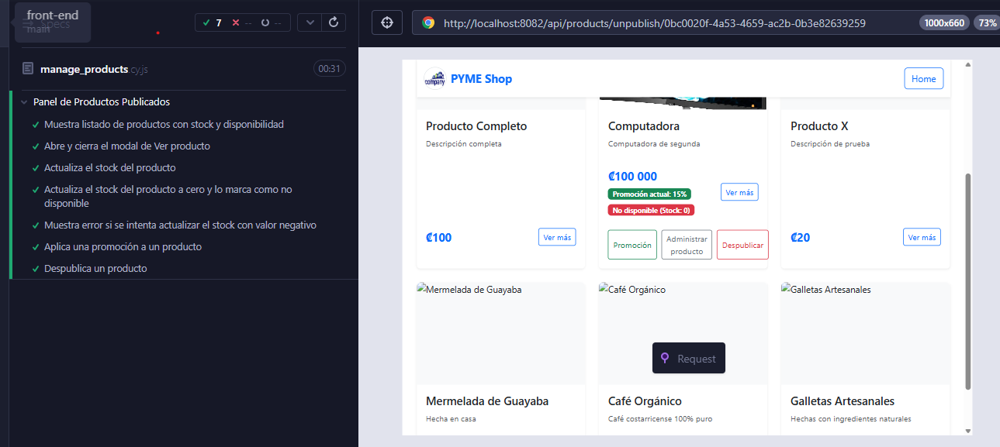

# **Documento de Pruebas End-to-End (E2E) - Gestión de Productos Publicados (Frontend)**

## **1. Descripción de la Funcionalidad**

Este documento describe las pruebas end-to-end automatizadas realizadas con **Cypress** para la funcionalidad de **gestión de productos publicados** por parte de las Pymes en la plataforma. Las pruebas validan la correcta visualización, administración de stock, aplicación de promociones y despublicación de productos desde el panel de productos publicados.

---

## **2. Escenarios de Prueba Cubiertos**

1. Visualización del listado de productos publicados con stock y disponibilidad.
2. Visualización y cierre del modal de información de producto.
3. Actualización del stock de un producto.
4. Actualización del stock a cero y marcado como no disponible.
5. Validación de error al intentar ingresar un stock negativo.
6. Aplicación de promoción a un producto.
7. Despublicación de un producto.

---

## **3. Casos de Prueba Automatizados con Cypress**

### Visualización del Listado de Productos

| Campo                  | Detalle                                                            |
| ---------------------- | ------------------------------------------------------------------ |
| **ID del Caso**        | FE-GESTPROD-E2E-001                                                |
| **Nombre del Test**    | `Muestra listado de productos con stock y disponibilidad`           |
| **Tipo de Prueba**     | E2E - Cypress                                                      |
| **Descripción**        | Verifica que el panel muestra correctamente los productos publicados con su stock. |
| **Pasos del Test**     | 1. Visitar `/productPublishPanel`  2. Validar visibilidad de productos y stock. |
| **Resultado Esperado** | Se visualizan las tarjetas de productos con información de stock y disponibilidad. |
| **Estado**             | Passed                                      |

---

### Modal de Información de Producto

| Campo                  | Detalle                                                            |
| ---------------------- | ------------------------------------------------------------------ |
| **ID del Caso**        | FE-GESTPROD-E2E-002                                                |
| **Nombre del Test**    | `Abre y cierra el modal de Ver producto`                           |
| **Tipo de Prueba**     | E2E - Cypress                                                      |
| **Descripción**        | Verifica que se puede abrir y cerrar el modal de información de producto. |
| **Pasos del Test**     | 1. Click en "Ver"  2. Validar modal visible  3. Cerrar modal  4. Validar cierre. |
| **Resultado Esperado** | El modal se muestra y se cierra correctamente.                     |
| **Estado**             | Passed                                      |

---

### Actualización de Stock

| Campo                  | Detalle                                                            |
| ---------------------- | ------------------------------------------------------------------ |
| **ID del Caso**        | FE-GESTPROD-E2E-003                                                |
| **Nombre del Test**    | `Actualiza el stock del producto`                                  |
| **Tipo de Prueba**     | E2E - Cypress                                                      |
| **Descripción**        | Permite actualizar el stock de un producto y refleja el cambio en la tarjeta. |
| **Pasos del Test**     | 1. Click en "Administrar producto"  2. Ingresar nuevo stock  3. Confirmar  4. Validar actualización. |
| **Resultado Esperado** | El stock se actualiza y se muestra el nuevo valor.                 |
| **Estado**             | Passed                                      |

---

### Stock en Cero y No Disponible

| Campo                  | Detalle                                                            |
| ---------------------- | ------------------------------------------------------------------ |
| **ID del Caso**        | FE-GESTPROD-E2E-004                                                |
| **Nombre del Test**    | `Actualiza el stock del producto a cero y lo marca como no disponible` |
| **Tipo de Prueba**     | E2E - Cypress                                                      |
| **Descripción**        | Al actualizar el stock a 0, el producto se marca como no disponible. |
| **Pasos del Test**     | 1. Administrar producto  2. Ingresar stock 0  3. Confirmar  4. Validar estado. |
| **Resultado Esperado** | El producto muestra "Stock: 0" y "No disponible".                  |
| **Estado**             | Passed                                      |

---

### Validación de Stock Negativo

| Campo                  | Detalle                                                            |
| ---------------------- | ------------------------------------------------------------------ |
| **ID del Caso**        | FE-GESTPROD-E2E-005                                                |
| **Nombre del Test**    | `Muestra error si se intenta actualizar el stock con valor negativo`|
| **Tipo de Prueba**     | E2E - Cypress                                                      |
| **Descripción**        | El sistema muestra error y deshabilita la confirmación si el stock es negativo. |
| **Pasos del Test**     | 1. Administrar producto  2. Ingresar stock negativo  3. Validar mensaje de error. |
| **Resultado Esperado** | Se muestra mensaje de error y no permite confirmar.                |
| **Estado**             | Passed                                      |

---

### Aplicación de Promoción

| Campo                  | Detalle                                                            |
| ---------------------- | ------------------------------------------------------------------ |
| **ID del Caso**        | FE-GESTPROD-E2E-006                                                |
| **Nombre del Test**    | `Aplica una promoción a un producto`                               |
| **Tipo de Prueba**     | E2E - Cypress                                                      |
| **Descripción**        | Permite aplicar un descuento a un producto y refleja la promoción aplicada. |
| **Pasos del Test**     | 1. Click en "Promoción"  2. Ingresar valor  3. Confirmar  4. Validar promoción. |
| **Resultado Esperado** | El producto muestra la promoción aplicada.                         |
| **Estado**             | Passed                                      |

---

### Despublicación de Producto

| Campo                  | Detalle                                                            |
| ---------------------- | ------------------------------------------------------------------ |
| **ID del Caso**        | FE-GESTPROD-E2E-007                                                |
| **Nombre del Test**    | `Despublica un producto`                                           |
| **Tipo de Prueba**     | E2E - Cypress                                                      |
| **Descripción**        | Permite despublicar un producto y valida que desaparece del panel. |
| **Pasos del Test**     | 1. Click en "Despublicar"  2. Confirmar  3. Validar cierre de modal. |
| **Resultado Esperado** | El producto se despublica correctamente.                           |
| **Estado**             | Passed                                      |
---

---

## **4. Script Cypress de Gestión de Productos Publicados**

```js
// cypress/e2e/productPublishPanel.cy.js
describe('Panel de Productos Publicados', () => {
  beforeEach(() => {
    window.localStorage.setItem('app_auth_pymeId', '320dd455-81eb-41bb-9612-5b2fa066be61');
    cy.visit('/productPublishPanel');
  });

  it('Muestra listado de productos con stock y disponibilidad', () => {
    cy.contains('Panel de Productos Publicados');
    cy.get('.product-card')
      .filter(':contains("Stock:")')
      .first()
      .should('exist')
      .and('contain.text', 'Stock:');
  });

  it('Abre y cierra el modal de Ver producto', () => {
    cy.get('.product-card').first().contains('Ver').click();
    cy.contains('Información del producto').should('be.visible');
    cy.get('.modal.show .btn-close').click();
    cy.contains('Información del producto').should('not.be.visible');
  });

  it('Actualiza el stock del producto', () => {
    cy.get('.product-card').filter(':has(button:contains("Administrar producto"))').first().as('targetCard');
    cy.get('@targetCard').within(() => {
      cy.contains('Administrar producto').should('be.visible').click();
    });

    cy.contains('Actualizar Stock').should('be.visible');
    cy.get('.modal.show input[name="stock"]')
      .should('have.attr', 'type', 'number')
      .and('have.attr', 'min', '0')
      .and('be.visible').clear()
      .type('10');
    cy.get('.modal.show').contains('Confirmar').click();
    cy.contains('Información del producto').should('not.be.visible');
    cy.wait(1000);
    cy.get('@targetCard').should($card => {
      expect($card.text()).to.include('Stock: 10');
    });
  });

  it('Actualiza el stock del producto a cero y lo marca como no disponible', () => {
    cy.get('.product-card').filter(':has(button:contains("Administrar producto"))')
      .filter(':contains("Stock:")').first().as('targetCard');
    cy.get('@targetCard').within(() => {
      cy.contains('Administrar producto').should('be.visible').click();
    });
    cy.contains('Actualizar Stock').should('be.visible');
    cy.get('.modal.show input[name="stock"]')
      .should('have.attr', 'type', 'number').should('be.visible').clear().type('0');
    cy.get('.modal.show').contains('Confirmar').click();
    cy.contains('Información del producto').should('not.be.visible');
    cy.get('@targetCard').should($card => {
      expect($card.text()).to.include('Stock: 0');
      expect($card.text().toLowerCase()).to.include('no disponible');
    });
  });

  it('Muestra error si se intenta actualizar el stock con valor negativo', () => {
    cy.get('.product-card').filter(':has(button:contains("Administrar producto"))')
      .filter(':contains("Stock:")').first().within(() => {
        cy.contains('Administrar producto').should('be.visible').click();
      });
    cy.get('.modal.show input[name="stock"]')
      .should('have.attr', 'type', 'number').should('be.visible').clear().type('-5');
    cy.contains('El valor ingresado no es válido.').should('be.visible');
    cy.get('.modal.show').contains('Confirmar').should('be.disabled');
    cy.get('.modal.show').contains('Cancelar').click();
  });

  it('Aplica una promoción a un producto', () => {
    cy.get('.product-card')
      .filter(':has(button:contains("Promoción"))')
      .filter(':contains("Stock:")')
      .first()
      .as('targetCard');
    cy.get('@targetCard').within(() => {
      cy.get('button').contains('Promoción').should('be.visible').click();
    });
    cy.contains('Aplicar Promoción').should('be.visible');
    cy.get('.modal.show input[name="discountValue"]').should('be.visible').clear().type('15');
    cy.get('.modal.show button[type="submit"]').should('not.be.disabled').click();
    cy.get('@targetCard').should($card => {
      expect($card.text()).to.include('Promoción actual: 15%');
    });
  });

  it('Despublica un producto', () => {
    cy.get('.product-card').contains('Despublicar').should('exist').click();
    cy.contains('Despublicar Producto').should('be.visible');
    cy.get('.modal.show .btn-primary').contains('Confirmar').click();
    cy.get('.modal.show', { timeout: 10000 }).should('not.exist');
  });
});
```

---

## **5. Conclusión**

Las pruebas E2E con Cypress permiten validar el flujo completo de gestión de productos publicados, asegurando que las funcionalidades clave como visualización, actualización de stock, aplicación de promociones y despublicación funcionen correctamente y brinden retroalimentación adecuada al usuario.

**Documento elaborado por: Keylin Vega Morales**
**Fecha: 26/06/2025**