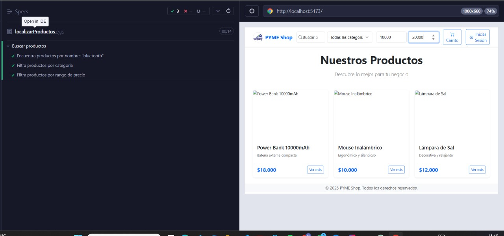

# **Documento de Pruebas End-to-End (E2E) - Localizar Productos (Frontend)**

## **1. Descripción de la Funcionalidad**

Este documento describe las pruebas automatizadas realizadas con **Cypress** para la funcionalidad de **localización de productos** desde el frontend del sistema. Estas pruebas se enfocan en verificar el comportamiento de búsqueda, filtrado y respuesta visual del sistema ante interacciones del usuario.

---

## **2. Escenarios de Prueba Cubiertos**

1. El campo de búsqueda es visible en las páginas relevantes para compradores registrados o anónimos.
2. Al ingresar texto en el campo de búsqueda, se actualizan los resultados dinámicamente sin recargar la página.
3. El sistema muestra sugerencias o autocompletado conforme se escribe en el campo de búsqueda.
4. Se puede seleccionar una o más categorías desde filtros disponibles para refinar los resultados mostrados.
5. Se permite filtrar productos por rango de precio desde un control deslizante o campos numéricos.
6. Se pueden aplicar filtros de disponibilidad (por ejemplo: solo productos en stock).
7. Se muestra un mensaje adecuado cuando no hay productos que coincidan con la búsqueda o filtros aplicados.
8. La interfaz es responsiva y funcional en dispositivos móviles y escritorio.

---

## **3. Casos de Prueba Automatizados con Cypress**

### Búsqueda por Nombre

| Campo                  | Detalle                                                              |
| ---------------------- | -------------------------------------------------------------------- |
| **ID del Caso**        | FE-LOCALIZAR-E2E-001                                                 |
| **Nombre del Test**    | `Encuentra productos por nombre: "bluetooth"`                        |
| **Tipo de Prueba**     | E2E - Cypress                                                        |
| **Descripción**        | Valida que los productos se filtren correctamente al ingresar texto. |
| **Pasos del Test**     | 1. Escribir "bluetooth" en el buscador. <br>2. Verificar resultados. |
| **Resultado Esperado** | Se muestran productos relevantes con esa palabra.                    |
| **Estado**             | Aprobado                                                             |

---

### Filtrado por Categoría

| Campo                  | Detalle                                                              |
| ---------------------- | -------------------------------------------------------------------- |
| **ID del Caso**        | FE-LOCALIZAR-E2E-002                                                 |
| **Nombre del Test**    | `Filtra productos por categoría`                                     |
| **Tipo de Prueba**     | E2E - Cypress                                                        |
| **Descripción**        | Verifica que los productos se filtren al elegir una categoría.       |
| **Pasos del Test**     | 1. Seleccionar categoría con valor "2". <br>2. Verificar resultados. |
| **Resultado Esperado** | Se muestran solo productos de la categoría seleccionada.             |
| **Estado**             | Aprobado                                                             |

---

### Filtrado por Rango de Precio

| Campo                  | Detalle                                                                      |
| ---------------------- | ---------------------------------------------------------------------------- |
| **ID del Caso**        | FE-LOCALIZAR-E2E-003                                                         |
| **Nombre del Test**    | `Filtra productos por rango de precio`                                       |
| **Tipo de Prueba**     | E2E - Cypress                                                                |
| **Descripción**        | Permite al usuario filtrar productos dentro de un rango de precios definido. |
| **Pasos del Test**     | 1. Ingresar precio mínimo y máximo. <br>2. Verificar resultados.             |
| **Resultado Esperado** | Solo se muestran productos dentro del rango establecido.                     |
| **Estado**             | Aprobado                                                                     |

---

## **4. Script Cypress - Localización de Productos**

```js
// cypress/e2e/localizarProductos.cy.js
describe('Buscar productos', () => {
  beforeEach(() => {
    cy.visit('/');
    cy.intercept('GET', '/api/products/search**').as('searchProducts');
  });

  it('Encuentra productos por nombre: "bluetooth"', () => {
    cy.get('input[placeholder="Buscar productos..."]').type('bluetooth');

    cy.wait('@searchProducts');
    cy.wait(1000);

    cy.get('.product-card')
      .should('exist')
      .and('be.visible');

    cy.contains('.product-card', 'bluetooth', { matchCase: false })
      .should('exist');

    cy.wait(1000);
  });

  it('Filtra productos por categoría', () => {
    cy.wait(1000);
    cy.get('select.form-select').select('2');
    cy.wait('@searchProducts');
    cy.wait(1000);

    cy.get('.product-card')
      .should('exist')
      .and('be.visible');

    cy.wait(1000);
  });

  it('Filtra productos por rango de precio', () => {
    cy.wait(1000);

    cy.get('input[placeholder="Precio mínimo"]').type('10000');
    cy.wait(500);
    cy.get('input[placeholder="Precio máximo"]').type('20000');

    cy.wait('@searchProducts');
    cy.wait(1000);

    cy.get('.product-card')
      .should('exist')
      .and('be.visible');

    cy.wait(1000);
  });
});
```

---

## **4. Evidencia Visual**



---

## **5. Conclusión**

Las pruebas automatizadas con Cypress demuestran que la funcionalidad de localización de productos permite a los usuarios buscar eficientemente por nombre, filtrar por categoría y por rango de precio. La interfaz responde correctamente y mantiene la experiencia de usuario tanto en escritorio como en dispositivos móviles.

**Documento elaborado por: Luis Daniel Solano Solano**
**Fecha: 26/06/2025**
