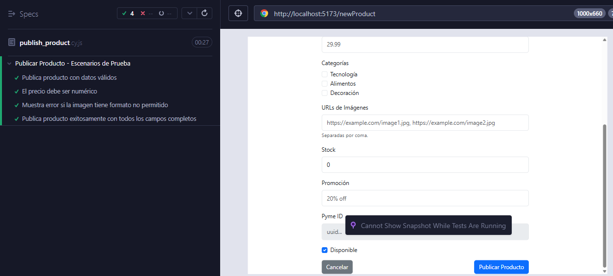

# **Documento de Pruebas End-to-End (E2E) - Publicación de Productos (Frontend)**

## **1. Descripción de la Funcionalidad**

Este documento describe las pruebas end-to-end automatizadas realizadas con **Cypress** para la funcionalidad de **publicación de productos** por parte de las Pymes en la plataforma. Las pruebas validan la correcta visualización del formulario, validaciones de campos, manejo de imágenes y la publicación exitosa de productos en el catálogo.

---

## **2. Escenarios de Prueba Cubiertos**

1. Publicación de producto con datos válidos.
2. Validación de campo precio: solo permite valores numéricos.
3. Validación de formato de imagen: solo se aceptan formatos permitidos.
4. Publicación exitosa con todos los campos completos.

---

## **3. Casos de Prueba Automatizados con Cypress**

### Publicación de Producto con Datos Válidos

| Campo                  | Detalle                                                            |
| ---------------------- | ------------------------------------------------------------------ |
| **ID del Caso**        | FE-PUBPROD-E2E-001                                                 |
| **Nombre del Test**    | `Publica producto con datos válidos`                               |
| **Tipo de Prueba**     | E2E - Cypress                                                      |
| **Descripción**        | Verifica que se puede publicar un producto completando los campos requeridos correctamente. |
| **Pasos del Test**     | 1. Visitar `/newProduct`  2. Completar campos obligatorios  3. Adjuntar imagen válida  4. Enviar formulario. |
| **Resultado Esperado** | El producto se publica y se muestra mensaje de éxito.              |
| **Estado**             | Passed                                      |

---

### Validación de Precio Numérico

| Campo                  | Detalle                                                            |
| ---------------------- | ------------------------------------------------------------------ |
| **ID del Caso**        | FE-PUBPROD-E2E-002                                                 |
| **Nombre del Test**    | `El precio debe ser numérico`                                      |
| **Tipo de Prueba**     | E2E - Cypress                                                      |
| **Descripción**        | Verifica que el campo precio solo acepte valores numéricos.         |
| **Pasos del Test**     | 1. Ingresar texto en campo precio  2. Validar que el campo queda vacío o muestra error. |
| **Resultado Esperado** | El campo no permite texto no numérico.                             |
| **Estado**             | Passed                                      |

---

### Validación de Formato de Imagen

| Campo                  | Detalle                                                            |
| ---------------------- | ------------------------------------------------------------------ |
| **ID del Caso**        | FE-PUBPROD-E2E-003                                                 |
| **Nombre del Test**    | `Muestra error si la imagen tiene formato no permitido`             |
| **Tipo de Prueba**     | E2E - Cypress                                                      |
| **Descripción**        | Verifica que solo se acepten imágenes en formatos permitidos.       |
| **Pasos del Test**     | 1. Adjuntar imagen con formato no permitido  2. Enviar formulario  3. Validar mensaje de error. |
| **Resultado Esperado** | Se muestra mensaje de error sobre la imagen.                       |
| **Estado**             | Passed                                      |

---

### Publicación Exitosa con Todos los Campos

| Campo                  | Detalle                                                            |
| ---------------------- | ------------------------------------------------------------------ |
| **ID del Caso**        | FE-PUBPROD-E2E-004                                                 |
| **Nombre del Test**    | `Publica producto exitosamente con todos los campos completos`      |
| **Tipo de Prueba**     | E2E - Cypress                                                      |
| **Descripción**        | Verifica que el producto se publica correctamente cuando todos los campos están completos y válidos. |
| **Pasos del Test**     | 1. Completar todos los campos  2. Adjuntar imagen válida  3. Enviar formulario. |
| **Resultado Esperado** | El producto se publica y se muestra mensaje de éxito.              |
| **Estado**             | Passed                                      |
---

---

## **4. Script Cypress de Publicación de Productos**

```js
// cypress/e2e/newProduct.cy.js
describe('Publicar Producto - Escenarios de Prueba', () => {
  beforeEach(() => {
    window.localStorage.setItem('app_auth_pymeId', '320dd455-81eb-41bb-9612-5b2fa066be61');
    cy.visit('/newProduct');
  });

  it('Publica producto con datos válidos', () => {
    cy.contains('Publicar Producto');
    cy.get('form').should('exist');
    cy.get('input[name="name"]').type('Producto X');
    cy.get('textarea[name="description"]').type('Descripción de prueba');
    cy.get('input[name="price"]').clear().type('20');
    cy.get('input[name="images"]').type('https://example.com/img.jpg');
    cy.get('input[name="stock"]').clear().type('5');
    cy.get('input[name="pyme_id"]').should('be.disabled');
    cy.get('input[type="checkbox"][class="form-check-input"]').first().check();
    cy.get('input[name="available"]').check();
    cy.get('button[type="submit"]').click();
    cy.contains('¡Producto publicado!').should('be.visible');
  });

  it('El precio debe ser numérico', () => {
    cy.get('input[name="name"]').type('Producto X');
    cy.get('textarea[name="description"]').type('Descripción de prueba');
    cy.get('input[name="price"]').clear().type('abc');
    cy.get('input[name="price"]').should('have.value', ''); // El campo queda vacío si se ingresa texto no numérico
    cy.get('input[name="images"]').type('https://example.com/img.jpg');
    cy.get('input[name="stock"]').clear().type('5');
    cy.get('input[name="pyme_id"]').should('be.disabled');
    cy.get('input[type="checkbox"][class="form-check-input"]').first().check();
    cy.get('input[name="available"]').check();
    cy.get('button[type="submit"]').click();
  });

  it('Muestra error si la imagen tiene formato no permitido', () => {
    cy.get('input[name="name"]').type('Producto X');
    cy.get('textarea[name="description"]').type('Descripción de prueba');
    cy.get('input[name="price"]').clear().type('20');
    cy.get('input[name="images"]').type('https://example.com/img.txt');
    cy.get('input[name="stock"]').clear().type('5');
    cy.get('input[name="pyme_id"]').should('be.disabled');
    cy.get('input[type="checkbox"][class="form-check-input"]').first().check();
    cy.get('input[name="available"]').check();
    cy.get('button[type="submit"]').click();
    cy.contains('La imagen no cumple con las especificaciones.').should('be.visible');
  });

  it('Publica producto exitosamente con todos los campos completos', () => {
    cy.get('input[name="name"]').type('Producto Completo');
    cy.get('textarea[name="description"]').type('Descripción completa');
    cy.get('input[name="price"]').clear().type('100');
    cy.get('input[name="images"]').type('https://example.com/img.jpg');
    cy.get('input[name="stock"]').clear().type('10');
    cy.get('input[name="promotion"]').type('10');
    cy.get('input[name="pyme_id"]').should('be.disabled');
    cy.get('input[type="checkbox"][class="form-check-input"]').first().check();
    cy.get('input[name="available"]').check();
    cy.get('button[type="submit"]').click();
    cy.contains('¡Producto publicado!').should('be.visible');
  });
});
```

---

## **5. Conclusión**

Las pruebas E2E con Cypress permiten validar el flujo completo de publicación de productos, asegurando que las validaciones de campos, manejo de imágenes y la publicación en el catálogo funcionen correctamente y brinden retroalimentación adecuada al usuario.

**Documento elaborado por: Keylin Vega Morales**
**Fecha: 26/06/2025**