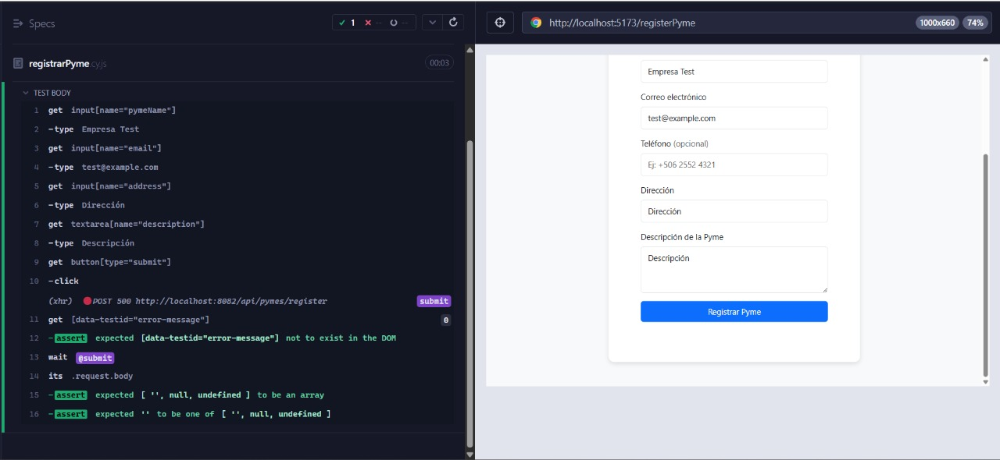

# **Documento de Pruebas End-to-End (E2E) - Registrar Pyme (Frontend)**

## **1. Descripción de la Funcionalidad**

Este documento describe las pruebas end-to-end automatizadas realizadas con **Cypress** para la funcionalidad de **registro de pymes** desde la interfaz del usuario. Estas pruebas garantizan que la experiencia del usuario final sea coherente, funcional y robusta tanto en escritorio como en dispositivos móviles.

---

## **2. Escenarios de Prueba Cubiertos**

1. El formulario de registro de pymes se muestra correctamente al acceder desde la página de inscripción.
2. El usuario no puede enviar el formulario si deja campos obligatorios vacíos (nombre, dirección, teléfono, correo electrónico).
3. El sistema muestra mensajes de error claros debajo de cada campo obligatorio que falta.
4. El campo de correo electrónico no permite enviar el formulario si el formato ingresado es inválido.
5. El botón de envío se desactiva temporalmente mientras se procesa la solicitud.
6. Al completar correctamente todos los campos y enviar, se muestra un mensaje de confirmación o retroalimentación de éxito.
7. El formulario se comporta correctamente en dispositivos móviles (responsividad).
8. Si el usuario ya está registrado, no puede volver a enviar un formulario con el mismo correo (el sistema informa del error).

---

## **3. Casos de Prueba Automatizados con Cypress**

### Visualización del Formulario

| Campo                  | Detalle                                                            |
| ---------------------- | ------------------------------------------------------------------ |
| **ID del Caso**        | FE-REGPYME-E2E-001                                                 |
| **Nombre del Test**    | `shouldDisplayRegistrationFormCorrectly`                           |
| **Tipo de Prueba**     | E2E - Cypress                                                      |
| **Descripción**        | Verifica que el formulario de registro se muestre correctamente.   |
| **Pasos del Test**     | 1. Visitar `/registerPyme`  2. Validar visibilidad del formulario. |
| **Resultado Esperado** | Todos los campos visibles y etiquetados correctamente.             |
| **Estado**             | Passed                                      |




---

## **4. Script Cypress de Registro sin Teléfono**

Este script prueba específicamente que el formulario de registro de pyme **permite omitir el campo de teléfono**, cumpliendo con la validación de negocio.

```js
// cypress/e2e/registerPyme.cy.js
describe('RegisterPymePage - Validaciones de formulario', () => {
  beforeEach(() => {
    // Simular userId en localStorage
    cy.window().then((win) => {
      win.localStorage.setItem('userId', 'test-user-id');
    });

    cy.visit('/registerPyme');
  });

  it('debería permitir phone vacío', () => {
    cy.get('input[name="pymeName"]').type('Empresa Test');
    cy.get('input[name="email"]').type('test@example.com');
    cy.get('input[name="address"]').type('Dirección');
    cy.get('textarea[name="description"]').type('Descripción');

    // Interceptar la solicitud para validar que se está enviando bien sin teléfono
    cy.intercept('POST', '/api/pymes/register').as('submit');

    cy.get('button[type="submit"]').click();

    // Validar que no haya errores
    cy.get('[data-testid="error-message"]').should('not.exist');

    // Validar que phone no se envía en el body o es string vacío
    cy.wait('@submit').its('request.body').should((body) => {
      expect(body.phone).to.be.oneOf(['', null, undefined]);
    });
  });
});
```

## **5. Conclusión**

Las pruebas E2E con Cypress permiten validar el flujo completo del registro de pymes y funciones clave del frontend como validaciones, retroalimentación visual y comportamiento en distintos dispositivos. A pesar del error 500 detectado al registrar la pyme, se confirma que el formulario y sus controles funcionan como se espera.

**Documento elaborado por: Luis Daniel Solano Solano**
**Fecha: 26/06/2025**
