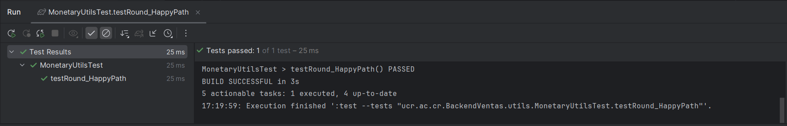
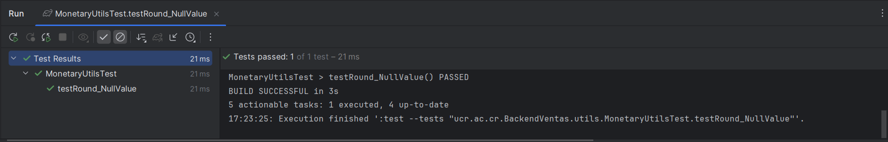
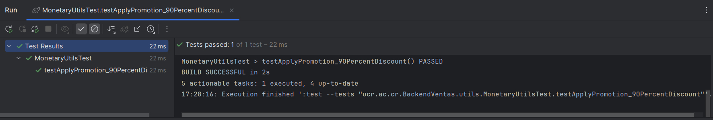
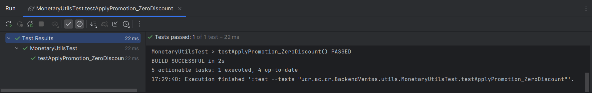
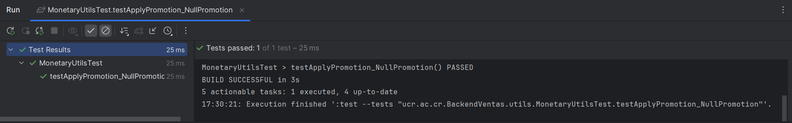

## HU- Proceso Compra: Pruebas Unitarias de Utilitario Monetario


Este documento presenta los **Casos de Prueba Unitarios (PC-MONETARY-UNIT)** correspondientes a la clase `MonetaryUtils`, encargada de realizar operaciones monetarias como redondeo de valores y aplicación de promociones. Las pruebas buscan garantizar el correcto funcionamiento de las utilidades de negocio asociadas al cálculo de precios, totales y descuentos.
Cada caso de prueba incluye:

- Identificador estructurado (`PC` por **Proceso de Compra**, `MONETARY` por el módulo, `UNIT` por el tipo).
    
- El nombre del método evaluado.
    
- La entrada utilizada.
    
- El comportamiento esperado.
    
- La validación del resultado obtenido.


### Redondeo Correcto - Valor decimal válido

| Campo                   | Detalle                                                                                                                                         |
|-------------------------|-------------------------------------------------------------------------------------------------------------------------------------------------|
| **ID del Caso**         | PC-MONETARY-UNIT-001                                                                                                                            |
| **Nombre del Test**     | `testRound_HappyPath`                                                                                                                           |
| **Tipo de Prueba**      | Unitario                                                                                                                                        |
| **Módulo**              | Utils / MonetaryUtils                                                                                                                           |
| **Historia de Usuario** | Proceso de compra                                                                                                                               |
| **Descripción**         | Valida que el método `round` redondee correctamente un valor decimal a dos cifras con modo `HALF_UP`.                                          |
| **Dato de Entrada**     | `15.6789`                                                                                                                                       |
| **Pasos del Test**      | 1. Crear un `BigDecimal` con valor `15.6789`.<br>2. Llamar a `MonetaryUtils.round(input)`.<br>3. Verificar que el resultado sea `15.68`.        |
| **Resultado Esperado**  | Se retorna `BigDecimal` con valor `15.68`.                                                                                                     |
| **Resultado Obtenido**  | El valor retornado fue `15.68` como se esperaba.                                                                                               |
| **Estado**              | Aprobado                                                                                                                                        |

```java
@Test
void testRound_HappyPath() {
    BigDecimal input = new BigDecimal("15.6789");
    BigDecimal expected = new BigDecimal("15.68"); // redondeo HALF_UP
    assertEquals(expected, MonetaryUtils.round(input));
}

```





---


### Redondeo Nulo - Valor `null` como entrada


### Valor Nulo - Redondeo Monetario

| Campo                   | Detalle                                                                                           |
|------------------------|---------------------------------------------------------------------------------------------------|
| **ID del Caso**         | PC-MONETARY-UNIT-002                                                                              |
| **Nombre del Test**     | `testRound_NullValue`                                                                             |
| **Tipo de Prueba**      | Unitario                                                                                          |
| **Módulo**              | Utils / MonetaryUtils                                                                             |
| **Historia de Usuario** | Proceso de Compra                                                                                 |
| **Descripción**         | Verifica que al recibir un valor nulo en el redondeo, se retorne `BigDecimal.ZERO`.              |
| **Dato de Entrada**     | `null`                                                                                            |
| **Pasos del Test**      | 1. Llamar al método `MonetaryUtils.round(null)`.  <br>2. Comparar el resultado con `BigDecimal.ZERO`. |
| **Resultado Esperado**  | El método retorna `BigDecimal.ZERO`.                                                              |
| **Resultado Obtenido**  | El valor retornado fue `BigDecimal.ZERO`, como se esperaba.                                       |
| **Estado**              | Aprobado                                                                                          |


```java

@Test  
void testRound_NullValue() {  
    assertEquals(BigDecimal.ZERO, MonetaryUtils.round(null));  
}

```




---


### Aplicar Promoción - Descuento del 90%

| Campo                   | Detalle                                                                                          |
|------------------------|--------------------------------------------------------------------------------------------------|
| **ID del Caso**         | PC-MONETARY-UNIT-003                                                                             |
| **Nombre del Test**     | `testApplyPromotion_90PercentDiscount`                                                           |
| **Tipo de Prueba**      | Unitario                                                                                         |
| **Módulo**              | Utils / MonetaryUtils                                                                            |
| **Historia de Usuario** | Proceso de Compra                                                                                |
| **Descripción**         | Verifica que el método aplique correctamente una promoción con un 90% de descuento.             |
| **Dato de Entrada**     | Precio: `100.00`, Promoción: `0.90`                                                              |
| **Pasos del Test**      | 1. Crear un precio de `100.00`. <br>2. Crear una promoción de `0.90`. <br>3. Aplicar el método `applyPromotion`. <br>4. Validar que el resultado sea `10.00`. |
| **Resultado Esperado**  | El valor retornado debe ser `10.00`, aplicando el 90% de descuento.                              |
| **Resultado Obtenido**  | El resultado fue `10.00`, tal como se esperaba.                                                  |
| **Estado**              | Aprobado                                                                                         |


```java

@Test  
void testApplyPromotion_90PercentDiscount() {  
    BigDecimal price = new BigDecimal("100.00");  
    BigDecimal promotion = new BigDecimal("0.90"); // 90% de descuento  
  
    BigDecimal expected = new BigDecimal("10.00");  
    assertEquals(expected, MonetaryUtils.applyPromotion(price, promotion));  
}

```




---


### Aplicar Promoción - Descuento del 0%

| Campo                   | Detalle                                                                                           |
|------------------------|---------------------------------------------------------------------------------------------------|
| **ID del Caso**         | PC-MONETARY-UNIT-004                                                                              |
| **Nombre del Test**     | `testApplyPromotion_ZeroDiscount`                                                                 |
| **Tipo de Prueba**      | Unitario                                                                                          |
| **Módulo**              | Utils / MonetaryUtils                                                                             |
| **Historia de Usuario** | Proceso de Compra                                                                                 |
| **Descripción**         | Verifica que al aplicar una promoción del 0%, el precio se mantenga sin cambios.                 |
| **Dato de Entrada**     | Precio: `75.00`, Promoción: `0.00`                                                                |
| **Pasos del Test**      | 1. Crear un precio de `75.00`. <br>2. Crear una promoción de `0.00`. <br>3. Aplicar el método `applyPromotion`. <br>4. Validar que el resultado sea `75.00`. |
| **Resultado Esperado**  | El valor retornado debe ser `75.00`, sin aplicarse ningún descuento.                             |
| **Resultado Obtenido**  | El resultado fue `75.00`, como se esperaba.                                                       |
| **Estado**              | Aprobado                                                                                          |


```java

@Test  
void testApplyPromotion_ZeroDiscount() {  
    BigDecimal price = new BigDecimal("75.00");  
    BigDecimal promotion = BigDecimal.ZERO;  
  
    BigDecimal expected = new BigDecimal("75.00");  
    assertEquals(expected, MonetaryUtils.applyPromotion(price, promotion));  
}

```





---


### Aplicar Promoción - Valor Nulo en Promoción

| Campo                   | Detalle                                                                                           |
|------------------------|---------------------------------------------------------------------------------------------------|
| **ID del Caso**         | PC-MONETARY-UNIT-005                                                                              |
| **Nombre del Test**     | `testApplyPromotion_NullPromotion`                                                                |
| **Tipo de Prueba**      | Unitario                                                                                          |
| **Módulo**              | Utils / MonetaryUtils                                                                             |
| **Historia de Usuario** | Proceso de Compra                                                                                 |
| **Descripción**         | Verifica que si el valor de la promoción es `null`, no se aplique ningún descuento.              |
| **Dato de Entrada**     | Precio: `50.00`, Promoción: `null`                                                                |
| **Pasos del Test**      | 1. Crear un precio de `50.00`. <br>2. Pasar `null` como promoción. <br>3. Aplicar el método `applyPromotion`. <br>4. Verificar que el resultado sea `50.00`. |
| **Resultado Esperado**  | El valor retornado debe ser `50.00`, ya que no se aplica ninguna promoción.                      |
| **Resultado Obtenido**  | El resultado fue `50.00`, como se esperaba.                                                       |
| **Estado**              | Aprobado                                                                                          |


```java

@Test  
void testApplyPromotion_NullPromotion() {  
    BigDecimal price = new BigDecimal("50.00");  
    BigDecimal promotion = null;  // sin descuento  
  
    BigDecimal expected = new BigDecimal("50.00");  
    assertEquals(expected, MonetaryUtils.applyPromotion(price, promotion));  
}

```


