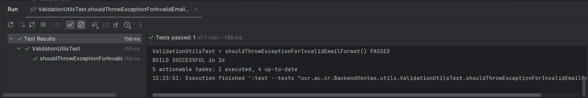
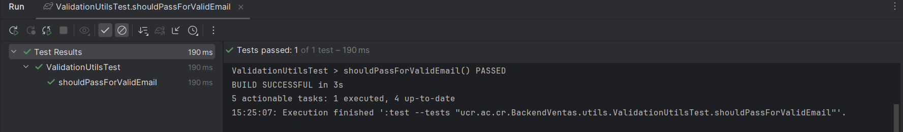
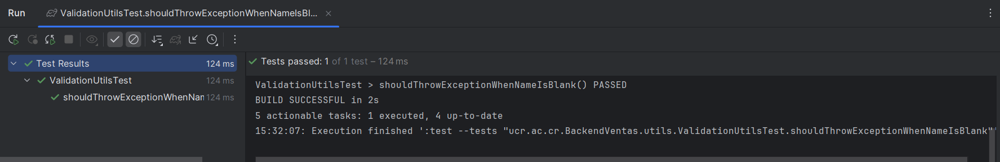
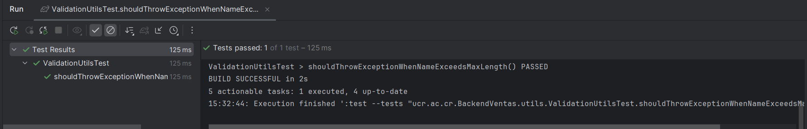
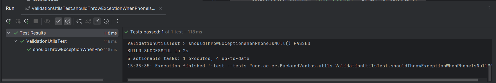
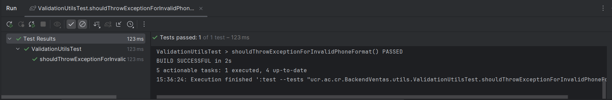
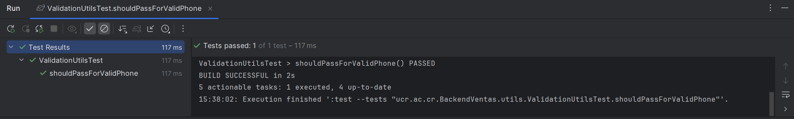
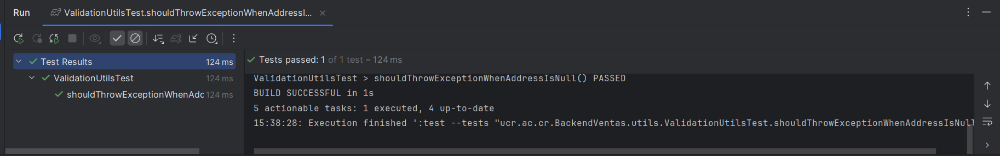
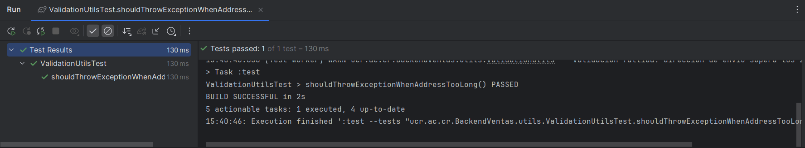
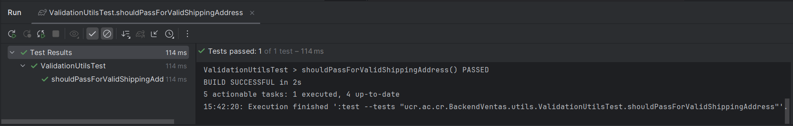

## Historia de Usuario: Proceso de Compra- Pruebas Unitarias de Validación

Este documento contiene los **Casos de Prueba Unitarios (PC-VALIDATION-UNIT)** para el módulo de validaciones dentro del backend del sistema de ventas. Las pruebas están enfocadas en verificar el comportamiento de los métodos utilitarios contenidos en la clase `ValidationUtils`, asegurando que cumplan con las reglas de negocio asociadas a la validación de campos como correo electrónico, nombre, teléfono y dirección de envío.

Cada caso de prueba incluye:

- La sigla de la historias de usuario asociada, en este caso `PC` como Proceso de Compra

- El nombre del método validado.
    
- La entrada proporcionada.
    
- El comportamiento esperado (ya sea la validación correcta o la excepción esperada).
    
- El código y mensaje de error cuando aplica.


### Email es nulo

| **ID del Caso**        | PC-VALIDATION-UNIT-001                                                                                         |
| ---------------------- | -------------------------------------------------------------------------------------------------------------- |
| **Nombre del Test**    | `shouldThrowExceptionWhenEmailIsNull`                                                                          |
| **Tipo de Prueba**     | Unitario                                                                                                       |
| **Módulo**             | Utils / Validaciones                                                                                           |
| **Método Validado**    | `ValidationUtils.validateEmail(String email)`                                                                  |
| **Descripción**        | Verifica que se lance una excepción cuando el email es `null`.                                                 |
| **Dato de Entrada**    | `null`                                                                                                         |
| **Pasos del Test**     | 1. Llamar a `validateEmail` con `null`.<br>2. Capturar excepción.<br>3. Validar código, mensaje y parámetros.  |
| **Resultado Esperado** | Se lanza `BaseException` con código `"REQUIRED_FIELDS"`, mensaje `"Debe ingresar un email"` y param `"email"`. |
| **Resultado Obtenido** | La excepción se lanzó con los valores esperados.                                                               |
| **Estado**             | Aprobado                                                                                                       |

```java

@Test  
void shouldThrowExceptionWhenEmailIsNull() {  
    BaseException exception = assertThrows(BaseException.class, () ->  
            ValidationUtils.validateEmail(null)  
    );  
  
    assertEquals("REQUIRED_FIELDS", exception.getCode());  
    assertEquals("Debe ingresar un email", exception.getMessage());  
    assertTrue(exception.getParams().contains("email"));  
}

```


---


### Formato de email inválido

| **ID del Caso**        | PC-VALIDATION-UNIT-002                                                                                      |
| ---------------------- | ----------------------------------------------------------------------------------------------------------- |
| **Nombre del Test**    | `shouldThrowExceptionForInvalidEmailFormat`                                                                 |
| **Tipo de Prueba**     | Unitario                                                                                                    |
| **Módulo**             | Utils / Validaciones                                                                                        |
| **Método Validado**    | `ValidationUtils.validateEmail(String email)`                                                               |
| **Descripción**        | Verifica que se lance una excepción si el email no tiene un formato válido.                                 |
| **Dato de Entrada**    | `"invalido.com"`                                                                                            |
| **Pasos del Test**     | 1. Llamar a `validateEmail` con `"invalido.com"`.<br>2. Capturar excepción.<br>3. Validar código y mensaje. |
| **Resultado Esperado** | Se lanza `BaseException` con código `"INVALID_FORMAT"` y mensaje `"El formato del email es inválido"`.      |
| **Resultado Obtenido** | La excepción se lanzó con los valores esperados.                                                            |
| **Estado**             | Aprobado                                                                                                    |

```java

@Test  
void shouldThrowExceptionForInvalidEmailFormat() {  
    BaseException exception = assertThrows(BaseException.class, () ->  
            ValidationUtils.validateEmail("invalido.com")  
    );  
  
    assertEquals("INVALID_FORMAT", exception.getCode());  
    assertEquals("El formato del email es inválido", exception.getMessage());  
}

``` 




---

### Email válido

| **ID del Caso**        | PC-VALIDATION-UNIT-003                                                                                 |
| ---------------------- | ------------------------------------------------------------------------------------------------------ |
| **Nombre del Test**    | `shouldPassForValidEmail`                                                                              |
| **Tipo de Prueba**     | Unitario                                                                                               |
| **Módulo**             | Utils / Validaciones                                                                                   |
| **Método Validado**    | `ValidationUtils.validateEmail(String email)`                                                          |
| **Descripción**        | Verifica que no se lance ninguna excepción al ingresar un correo con formato válido.                   |
| **Dato de Entrada**    | `"test@email.com"`                                                                                     |
| **Pasos del Test**     | 1. Llamar a `validateEmail` con `"test@email.com"`.<br>2. Verificar que no se lanza ninguna excepción. |
| **Resultado Esperado** | La ejecución finaliza sin excepciones.                                                                 |
| **Resultado Obtenido** | No se lanzó ninguna excepción.                                                                         |
| **Estado**             | Aprobado                                                                                               |


```java

@Test  
void shouldPassForValidEmail() {  
    assertDoesNotThrow(() -> ValidationUtils.validateEmail("test@email.com"));  
}

```




---


### Nombre de comprador en blanco y/o nulo

| **ID del Caso**        | PC-VALIDATION-UNIT-004                                                                                                                 |
| ---------------------- | -------------------------------------------------------------------------------------------------------------------------------------- |
| **Nombre del Test**    | `shouldThrowExceptionWhenNameIsBlank`                                                                                                  |
| **Tipo de Prueba**     | Unitario                                                                                                                               |
| **Módulo**             | Utils / Validaciones                                                                                                                   |
| **Método Validado**    | `ValidationUtils.validateName(String field, String value)`                                                                             |
| **Descripción**        | Verifica que se lance una excepción si el campo de nombre está vacío.                                                                  |
| **Dato de Entrada**    | `"firstName", ""`                                                                                                                      |
| **Pasos del Test**     | 1. Llamar a `validateName("firstName", "")`.<br>2. Verificar que se lanza `BaseException`.<br>3. Validar el código y mensaje de error. |
| **Resultado Esperado** | Se lanza `BaseException` con código `REQUIRED_FIELDS` y mensaje `"Debes ingresar firstName"`.                                          |
| **Resultado Obtenido** | Se lanzó correctamente la excepción con el código y mensaje esperados.                                                                 |
| **Estado**             | Aprobado                                                                                                                               |

```java

@Test  
void shouldThrowExceptionWhenNameIsBlank() {  
    BaseException exception = assertThrows(BaseException.class, () ->  
            ValidationUtils.validateName("firstName", "")  
    );  
    assertEquals("REQUIRED_FIELDS", exception.getCode());  
    assertEquals("Debes ingresar firstName", exception.getMessage());  
}

```





---

### Nombre de comprador excede el máximo de carácteres permitidos

| **ID del Caso**        | PC-VALIDATION-UNIT-005                                                                                                |
| ---------------------- | --------------------------------------------------------------------------------------------------------------------- |
| **Nombre del Test**    | `shouldThrowExceptionWhenNameExceedsMaxLength`                                                                        |
| **Tipo de Prueba**     | Unitario                                                                                                              |
| **Módulo**             | Utils / Validaciones                                                                                                  |
| **Método Validado**    | `ValidationUtils.validateName(String field, String value)`                                                            |
| **Descripción**        | Verifica que se lance una excepción si el nombre excede los 100 caracteres.                                           |
| **Dato de Entrada**    | `"lastName", "aaaaaaaa...aaa"` (101 caracteres)                                                                       |
| **Pasos del Test**     | 1. Generar string largo con 101 caracteres.<br>2. Llamar a `validateName`.<br>3. Verificar excepción y mensaje.       |
| **Resultado Esperado** | Se lanza `BaseException` con código `INVALID_FORMAT` y mensaje que menciona que no puede tener más de 100 caracteres. |
| **Resultado Obtenido** | Se lanzó correctamente la excepción con el código y mensaje esperados.                                                |
| **Estado**             | Aprobado                                                                                                              |


```java

@Test  
void shouldThrowExceptionWhenNameExceedsMaxLength() {  
    String longName = "a".repeat(101);  
    BaseException exception = assertThrows(BaseException.class, () ->  
            ValidationUtils.validateName("lastName", longName)  
    );  
    assertEquals("INVALID_FORMAT", exception.getCode());  
    assertTrue(exception.getMessage().contains("no puede tener más de 100 caracteres"));  
}

```




---


### Teléfono es nulo

| **ID del Caso**        | PC-VALIDATION-UNIT-006                                                                      |
| ---------------------- | ------------------------------------------------------------------------------------------- |
| **Nombre del Test**    | `shouldThrowExceptionWhenPhoneIsNull`                                                       |
| **Tipo de Prueba**     | Unitario                                                                                    |
| **Módulo**             | Utils / Validaciones                                                                        |
| **Método Validado**    | `ValidationUtils.validatePhone(String value)`                                               |
| **Descripción**        | Verifica que se lance una excepción si el número de teléfono es `null`.                     |
| **Dato de Entrada**    | `null`                                                                                      |
| **Pasos del Test**     | 1. Pasar `null` al método `validatePhone`.<br>2. Capturar la excepción y validar el código. |
| **Resultado Esperado** | Se lanza `BaseException` con código `REQUIRED_FIELDS`.                                      |
| **Resultado Obtenido** | Se lanzó correctamente la excepción con el código esperado.                                 |
| **Estado**             | Aprobado                                                                                    |


```java

@Test  
void shouldThrowExceptionWhenPhoneIsNull() {  
    BaseException exception = assertThrows(BaseException.class, () ->  
            ValidationUtils.validatePhone(null)  
    );  
    assertEquals("REQUIRED_FIELDS", exception.getCode());  
}

```



---

### Formato de teléfono es inválido

| **ID del Caso**        | PC-VALIDATION-UNIT-007                                                                          |
| ---------------------- | ----------------------------------------------------------------------------------------------- |
| **Nombre del Test**    | `shouldThrowExceptionForInvalidPhoneFormat`                                                     |
| **Tipo de Prueba**     | Unitario                                                                                        |
| **Módulo**             | Utils / Validaciones                                                                            |
| **Método Validado**    | `ValidationUtils.validatePhone(String value)`                                                   |
| **Descripción**        | Verifica que se lance una excepción si el número de teléfono tiene un formato inválido.         |
| **Dato de Entrada**    | `"abc123"`                                                                                      |
| **Pasos del Test**     | 1. Pasar `"abc123"` al método `validatePhone`.<br>2. Capturar la excepción y validar su código. |
| **Resultado Esperado** | Se lanza `BaseException` con código `INVALID_FORMAT`.                                           |
| **Resultado Obtenido** | Excepción lanzada correctamente con el código esperado.                                         |
| **Estado**             | Aprobado                                                                                        |


```java

@Test  
void shouldThrowExceptionForInvalidPhoneFormat() {  
    BaseException exception = assertThrows(BaseException.class, () ->  
            ValidationUtils.validatePhone("abc123")  
    );  
    assertEquals("INVALID_FORMAT", exception.getCode());  
}

```




---

### Teléfono es Válido

| **ID del Caso**        | PC-VALIDATION-UNIT-008                                                                            |
| ---------------------- | ------------------------------------------------------------------------------------------------- |
| **Nombre del Test**    | `shouldPassForValidPhone`                                                                         |
| **Tipo de Prueba**     | Unitario                                                                                          |
| **Módulo**             | Utils / Validaciones                                                                              |
| **Método Validado**    | `ValidationUtils.validatePhone(String value)`                                                     |
| **Descripción**        | Verifica que no se lance ninguna excepción si el número de teléfono tiene un formato válido.      |
| **Datos de Entrada**   | `"8888-8888"`, `"88888888"`                                                                       |
| **Pasos del Test**     | 1. Pasar los valores al método `validatePhone`.<br>2. Confirmar que no se lanza excepción alguna. |
| **Resultado Esperado** | No se lanza ninguna excepción para ambos formatos.                                                |
| **Resultado Obtenido** | El método se ejecutó correctamente sin errores.                                                   |
| **Estado**             | Aprobado                                                                                          |


```java

@Test  
void shouldPassForValidPhone() {  
    assertDoesNotThrow(() -> ValidationUtils.validatePhone("8888-8888"));  
    assertDoesNotThrow(() -> ValidationUtils.validatePhone("88888888"));  
}

```




---

### Dirección de residencia es nula

| **ID del Caso**        | PC-VALIDATION-UNIT-009                                                                    |
| ---------------------- | ----------------------------------------------------------------------------------------- |
| **Nombre del Test**    | `shouldThrowExceptionWhenAddressIsNull`                                                   |
| **Tipo de Prueba**     | Unitario                                                                                  |
| **Módulo**             | Utils / Validaciones                                                                      |
| **Método Validado**    | `ValidationUtils.validateShippingAddress(String address)`                                 |
| **Descripción**        | Verifica que se lance una excepción si la dirección de envío es `null`.                   |
| **Datos de Entrada**   | `null`                                                                                    |
| **Pasos del Test**     | 1. Llamar al método `validateShippingAddress(null)`.<br>2. Capturar la excepción lanzada. |
| **Resultado Esperado** | Se lanza una excepción de tipo `BaseException` con código `REQUIRED_FIELDS`.              |
| **Resultado Obtenido** | Excepción lanzada correctamente con código `REQUIRED_FIELDS`.                             |
| **Estado**             | Aprobado                                                                                  |


```java
@Test  
void shouldThrowExceptionWhenAddressIsNull() {  
    BaseException exception = assertThrows(BaseException.class, () ->  
            ValidationUtils.validateShippingAddress(null)  
    );  
    assertEquals("REQUIRED_FIELDS", exception.getCode());  
}

```




---

### Dirección de residencia es excede el número de carácteres

| **ID del Caso**        | PC-VALIDATION-UNIT-010                                                                                           |
| ---------------------- | ---------------------------------------------------------------------------------------------------------------- |
| **Nombre del Test**    | `shouldThrowExceptionWhenAddressTooLong`                                                                         |
| **Tipo de Prueba**     | Unitario                                                                                                         |
| **Módulo**             | Utils / Validaciones                                                                                             |
| **Método Validado**    | `ValidationUtils.validateShippingAddress(String address)`                                                        |
| **Descripción**        | Verifica que se lance una excepción si la dirección excede los 200 caracteres permitidos.                        |
| **Datos de Entrada**   | Cadena de texto de 201 caracteres (`"aaaa...a"`)                                                                 |
| **Pasos del Test**     | 1. Construir una dirección de 201 caracteres.<br>2. Llamar al método de validación.<br>3. Capturar la excepción. |
| **Resultado Esperado** | Se lanza una excepción `BaseException` con código `INVALID_FORMAT`.                                              |
| **Resultado Obtenido** | Excepción lanzada correctamente con código `INVALID_FORMAT`.                                                     |
| **Estado**             | Aprobado                                                                                                         |


```java

@Test  
void shouldThrowExceptionWhenAddressTooLong() {  
    String longAddress = "a".repeat(201);  
    BaseException exception = assertThrows(BaseException.class, () ->  
            ValidationUtils.validateShippingAddress(longAddress)  
    );  
    assertEquals("INVALID_FORMAT", exception.getCode());  
}

```




---


### Dirección de residencia  válida

| **ID del Caso**        | PC-VALIDATION-UNIT-011                                                                                 |
| ---------------------- | ------------------------------------------------------------------------------------------------------ |
| **Nombre del Test**    | `shouldPassForValidShippingAddress`                                                                    |
| **Tipo de Prueba**     | Unitario                                                                                               |
| **Módulo**             | Utils / Validaciones                                                                                   |
| **Método Validado**    | `ValidationUtils.validateShippingAddress(String address)`                                              |
| **Descripción**        | Verifica que una dirección válida no lance ninguna excepción.                                          |
| **Datos de Entrada**   | `"San José, Av. Central, Edificio XYZ"`                                                                |
| **Pasos del Test**     | 1. Llamar al método de validación con la dirección.<br>2. Confirmar que no se lanza ninguna excepción. |
| **Resultado Esperado** | El método se ejecuta sin lanzar excepción.                                                             |
| **Resultado Obtenido** | No se lanzó ninguna excepción, validación exitosa.                                                     |
| **Estado**             | Aprobado                                                                                               |


```java

@Test  
void shouldPassForValidShippingAddress() {  
    assertDoesNotThrow(() ->  
            ValidationUtils.validateShippingAddress("San José, Av. Central, Edificio XYZ")  
    );  
}

```

