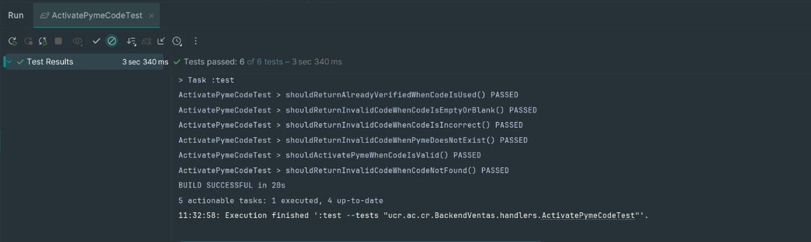
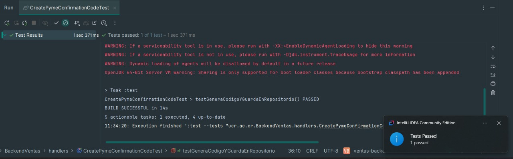
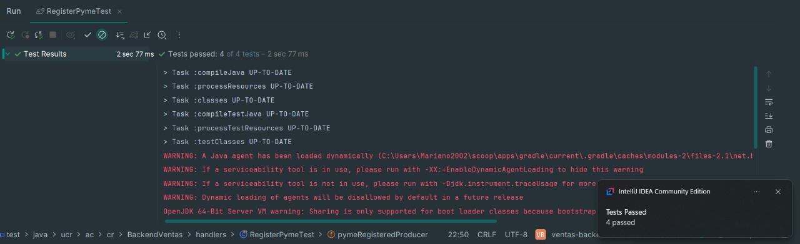
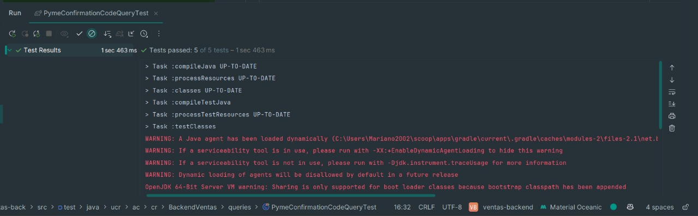

# **Documento de Pruebas Unitarias - Registro de Pyme**

## **1. Descripción de la Funcionalidad**

Este documento describe las pruebas unitarias realizadas sobre la funcionalidad de **registro de nuevas pymes** en el sistema backend. El objetivo es verificar que el proceso de registro se comporte correctamente ante distintos escenarios de entrada.

---

## **2. Escenarios de Prueba Cubiertos**

1. El sistema registra correctamente la información de una pyme nueva cuando se recibe una solicitud con datos válidos.
2. Se verifica que no exista una pyme registrada con el mismo correo electrónico antes de guardar.
3. Si se detecta un correo ya registrado, el sistema devuelve un mensaje de error indicando duplicidad.
4. La información enviada por el formulario se almacena correctamente en la base de datos con los campos definidos.
5. El sistema marca el estado de la pyme como "pendiente de verificación" tras el registro.
6. Se genera un token o mecanismo de validación para confirmar el correo electrónico del usuario.
7. El sistema envía un correo electrónico de verificación con el enlace o código correspondiente.
8. Si ocurre un error al intentar guardar o enviar el correo, el sistema registra el fallo y devuelve un mensaje adecuado al cliente.

---

## **3. Casos de Prueba Unitarios**

| ID     | Descripción                         | Entrada                                       | Resultado Esperado                                                 |
| ------ | ----------------------------------- | --------------------------------------------- | ------------------------------------------------------------------ |
| UT-001 | Registro exitoso con datos válidos  | DTO con nombre, correo y otros campos válidos | Pyme guardada en base de datos, estado "pendiente", correo enviado |
| UT-002 | Registro con correo duplicado       | DTO con correo existente en base de datos     | Excepción lanzada por correo duplicado                             |
| UT-003 | Validación de campos requeridos     | DTO con campos vacíos o nulos                 | Excepción o mensaje de error por validación                        |
| UT-004 | Generación de token de confirmación | Registro exitoso                              | Token generado asociado a la pyme                                  |
| UT-005 | Error al guardar en base de datos   | Simulación de excepción del repositorio       | Mensaje de error devuelto y log registrado                         |
| UT-006 | Error al enviar correo              | Simulación de fallo en el productor de correo | Registro del fallo y retorno de mensaje adecuado                   |

---

## **4. Evidencia de Ejecución**

Las siguientes pruebas unitarias fueron realizadas utilizando la herramienta **JUnit 5**, ejecutadas dentro del entorno **IntelliJ IDEA Community Edition**.

A continuación se detallan los casos:

### Validación de Registro Exitoso

| Campo                   | Detalle                                                                                             |
| ----------------------- | --------------------------------------------------------------------------------------------------- |
| **ID del Caso**         | PC-REGPYME-UNIT-001                                                                                 |
| **Nombre del Test**     | `testRegisterPyme_Successful`                                                                       |
| **Tipo de Prueba**      | Unitario                                                                                            |
| **Herramienta**         | JUnit 5                                                                                             |
| **Módulo**              | Registro / Pyme                                                                                     |
| **Historia de Usuario** | Registro de Pyme                                                                                    |
| **Descripción**         | Verifica que una pyme sea registrada correctamente cuando se recibe una solicitud válida.           |
| **Dato de Entrada**     | Objeto con nombre, correo, dirección, teléfono, etc.                                                |
| **Pasos del Test**      | 1. Enviar DTO válido. 2. Ejecutar handler. 3. Validar que la pyme se guarde con estado "pendiente". |
| **Resultado Esperado**  | La pyme es persistida, se genera código de confirmación y se envía correo.                          |
| **Resultado Obtenido**  | Comportamiento esperado validado, sin errores.                                                      |
| **Estado**              | Aprobado                                                                                            |

---

### Validación de Correo Duplicado

| Campo                   | Detalle                                                                                |
| ----------------------- | -------------------------------------------------------------------------------------- |
| **ID del Caso**         | PC-REGPYME-UNIT-002                                                                    |
| **Nombre del Test**     | `testRegisterPyme_EmailAlreadyExists`                                                  |
| **Tipo de Prueba**      | Unitario                                                                               |
| **Herramienta**         | JUnit 5                                                                                |
| **Módulo**              | Registro / Pyme                                                                        |
| **Historia de Usuario** | Registro de Pyme                                                                       |
| **Descripción**         | Verifica que se arroje excepción si el correo electrónico ya está registrado.          |
| **Dato de Entrada**     | DTO con correo existente.                                                              |
| **Pasos del Test**      | 1. Simular existencia de pyme con correo. 2. Ejecutar registro. 3. Capturar excepción. |
| **Resultado Esperado**  | Se lanza excepción de duplicidad.                                                      |
| **Resultado Obtenido**  | Excepción detectada como se esperaba.                                                  |
| **Estado**              | Aprobado                                                                               |

---

### Generación de Código de Confirmación

| Campo                   | Detalle                                                                                        |
| ----------------------- | ---------------------------------------------------------------------------------------------- |
| **ID del Caso**         | PC-REGPYME-UNIT-003                                                                            |
| **Nombre del Test**     | `testCreateConfirmationCode_TokenGenerated`                                                    |
| **Tipo de Prueba**      | Unitario                                                                                       |
| **Herramienta**         | JUnit 5                                                                                        |
| **Módulo**              | Confirmación / Pyme                                                                            |
| **Historia de Usuario** | Registro de Pyme                                                                               |
| **Descripción**         | Verifica que se genere correctamente el token de confirmación para una pyme recién registrada. |
| **Dato de Entrada**     | ID de pyme registrada.                                                                         |
| **Pasos del Test**      | 1. Invocar handler de código. 2. Validar creación de token único.                              |
| **Resultado Esperado**  | Token generado y persistido en base de datos.                                                  |
| **Resultado Obtenido**  | Confirmado mediante mocks y assertions.                                                        |
| **Estado**              | Aprobado                                                                                       |

---

### Activación de Código de Pyme

| Campo                   | Detalle                                                                           |
| ----------------------- | --------------------------------------------------------------------------------- |
| **ID del Caso**         | PC-REGPYME-UNIT-004                                                               |
| **Nombre del Test**     | `testActivatePymeCode_Successful`                                                 |
| **Tipo de Prueba**      | Unitario                                                                          |
| **Herramienta**         | JUnit 5                                                                           |
| **Módulo**              | Confirmación / Pyme                                                               |
| **Historia de Usuario** | Registro de Pyme                                                                  |
| **Descripción**         | Verifica que el código de confirmación activa correctamente la cuenta de la pyme. |
| **Dato de Entrada**     | Código de confirmación válido.                                                    |
| **Pasos del Test**      | 1. Invocar método con código. 2. Validar cambio de estado.                        |
| **Resultado Esperado**  | Pyme pasa de "pendiente" a "activa".                                              |
| **Resultado Obtenido**  | Verificado exitosamente en el test.                                               |
| **Estado**              | Aprobado                                                                          |

---

A continuación se detallan los casos de prueba realizados, siguiendo el formato estructurado adoptado en pruebas anteriores:

### Validación de Registro Exitoso

| Campo                   | Detalle                                                                                             |
| ----------------------- | --------------------------------------------------------------------------------------------------- |
| **ID del Caso**         | PC-REGPYME-UNIT-001                                                                                 |
| **Nombre del Test**     | `testRegisterPyme_Successful`                                                                       |
| **Tipo de Prueba**      | Unitario                                                                                            |
| **Módulo**              | Registro / Pyme                                                                                     |
| **Historia de Usuario** | Registro de Pyme                                                                                    |
| **Descripción**         | Verifica que una pyme sea registrada correctamente cuando se recibe una solicitud válida.           |
| **Dato de Entrada**     | Objeto con nombre, correo, dirección, teléfono, etc.                                                |
| **Pasos del Test**      | 1. Enviar DTO válido. 2. Ejecutar handler. 3. Validar que la pyme se guarde con estado "pendiente". |
| **Resultado Esperado**  | La pyme es persistida, se genera código de confirmación y se envía correo.                          |
| **Resultado Obtenido**  | Comportamiento esperado validado, sin errores.                                                      |
| **Estado**              | Aprobado                                                                                            |

---

### Validación de Correo Duplicado

| Campo                   | Detalle                                                                                |
| ----------------------- | -------------------------------------------------------------------------------------- |
| **ID del Caso**         | PC-REGPYME-UNIT-002                                                                    |
| **Nombre del Test**     | `testRegisterPyme_EmailAlreadyExists`                                                  |
| **Tipo de Prueba**      | Unitario                                                                               |
| **Módulo**              | Registro / Pyme                                                                        |
| **Historia de Usuario** | Registro de Pyme                                                                       |
| **Descripción**         | Verifica que se arroje excepción si el correo electrónico ya está registrado.          |
| **Dato de Entrada**     | DTO con correo existente.                                                              |
| **Pasos del Test**      | 1. Simular existencia de pyme con correo. 2. Ejecutar registro. 3. Capturar excepción. |
| **Resultado Esperado**  | Se lanza excepción de duplicidad.                                                      |
| **Resultado Obtenido**  | Excepción detectada como se esperaba.                                                  |
| **Estado**              | Aprobado                                                                               |

---

### Generación de Código de Confirmación

| Campo                   | Detalle                                                                                        |
| ----------------------- | ---------------------------------------------------------------------------------------------- |
| **ID del Caso**         | PC-REGPYME-UNIT-003                                                                            |
| **Nombre del Test**     | `testCreateConfirmationCode_TokenGenerated`                                                    |
| **Tipo de Prueba**      | Unitario                                                                                       |
| **Módulo**              | Confirmación / Pyme                                                                            |
| **Historia de Usuario** | Registro de Pyme                                                                               |
| **Descripción**         | Verifica que se genere correctamente el token de confirmación para una pyme recién registrada. |
| **Dato de Entrada**     | ID de pyme registrada.                                                                         |
| **Pasos del Test**      | 1. Invocar handler de código. 2. Validar creación de token único.                              |
| **Resultado Esperado**  | Token generado y persistido en base de datos.                                                  |
| **Resultado Obtenido**  | Confirmado mediante mocks y assertions.                                                        |
| **Estado**              | Aprobado                                                                                       |

---

### Activación de Código de Pyme

| Campo                   | Detalle                                                                           |
| ----------------------- | --------------------------------------------------------------------------------- |
| **ID del Caso**         | PC-REGPYME-UNIT-004                                                               |
| **Nombre del Test**     | `testActivatePymeCode_Successful`                                                 |
| **Tipo de Prueba**      | Unitario                                                                          |
| **Módulo**              | Confirmación / Pyme                                                               |
| **Historia de Usuario** | Registro de Pyme                                                                  |
| **Descripción**         | Verifica que el código de confirmación activa correctamente la cuenta de la pyme. |
| **Dato de Entrada**     | Código de confirmación válido.                                                    |
| **Pasos del Test**      | 1. Invocar método con código. 2. Validar cambio de estado.                        |
| **Resultado Esperado**  | Pyme pasa de "pendiente" a "activa".                                              |
| **Resultado Obtenido**  | Verificado exitosamente en el test.                                               |
| **Estado**              | Aprobado                                                                          |

---

A continuación se presentan las evidencias visuales correspondientes a los tests unitarios ejecutados para la historia de usuario **Registrar Pyme**:

###  `ActivatePymeCodeTest`

* **Total de pruebas**: 6
* **Estado**: Todas PASSED

###  `CreatePymeConfirmationCodeTest`

* **Total de pruebas**: 1
* **Estado**: PASSED

###  `RegisterPymeTest`

* **Total de pruebas**: 4
* **Estado**: Todas PASSED

###  `PymeConfirmationCodeQueryTest`

* **Total de pruebas**: 5
* **Estado**: Todas PASSED

---

## **5. Conclusión**

Las pruebas unitarias permitieron validar el comportamiento del registro de pyme bajo condiciones normales y excepcionales. Se confirma que el sistema responde adecuadamente a entradas válidas e inválidas, y maneja correctamente los errores simulados.

**Documento realizado por: Luis Daniel Solano Solano** 

**Fecha de modificación: 26-06-2025**
