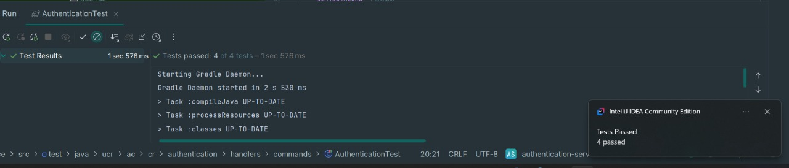
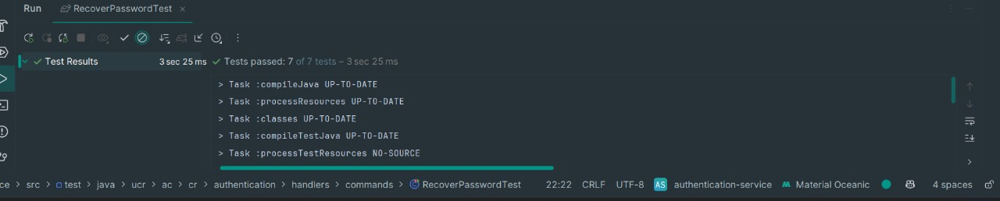
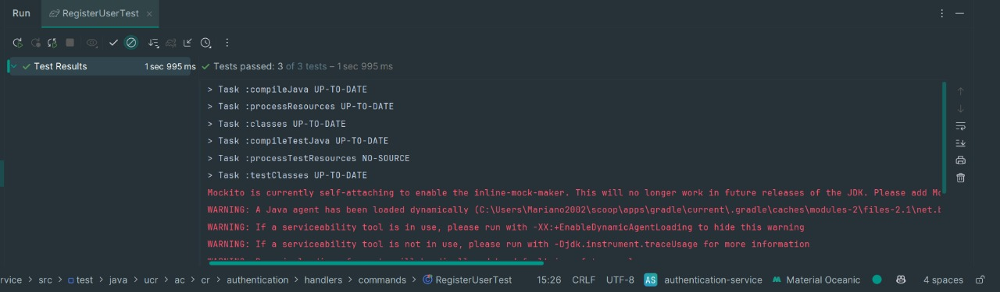
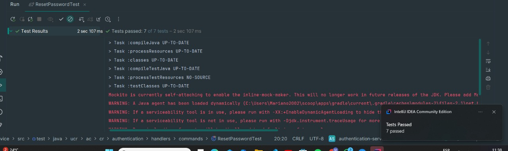
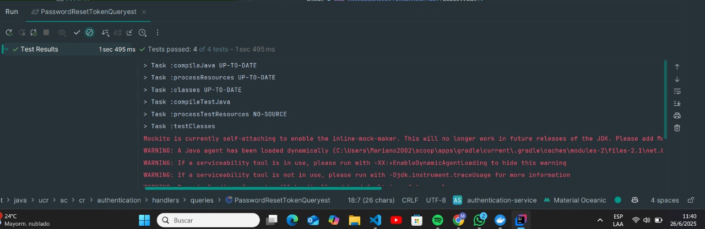
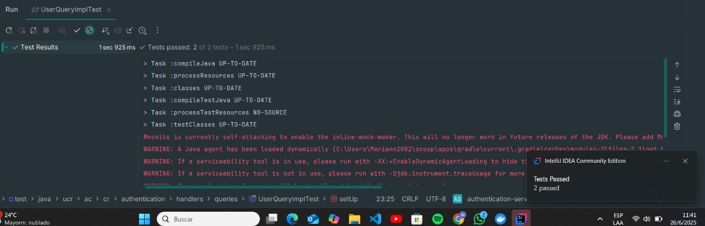

# **Documento de Pruebas Unitarias - Authentication Service**

## **1. Descripción de la Funcionalidad**

Este documento presenta las pruebas unitarias realizadas sobre las funcionalidades del **servicio de autenticación** (Authentication Service). Las pruebas están alineadas con los escenarios funcionales de la historia de usuario **Registrar Pyme**, verificando procesos clave como el registro de usuario, autenticación, recuperación y restablecimiento de contraseña.

---

## **2. Escenarios de Prueba Cubiertos**

1. El sistema registra correctamente la cuenta de usuario asociada a la pyme.
2. El sistema valida credenciales correctas durante el inicio de sesión.
3. El sistema rechaza intentos de acceso con credenciales inválidas.
4. Se puede iniciar el proceso de recuperación de contraseña con un correo válido.
5. El sistema genera un token de recuperación y lo almacena correctamente.
6. Se valida el token recibido para permitir el restablecimiento.
7. La contraseña se actualiza exitosamente tras una solicitud válida.

---

## **3. Casos de Prueba Unitarios**

Se presentan los principales casos de prueba, utilizando **JUnit 5** en **IntelliJ IDEA Community Edition**:

---

### 🔹 Registro de Usuario

| Campo                   | Detalle                                                                                   |
| ----------------------- | ----------------------------------------------------------------------------------------- |
| **ID del Caso**         | PC-AUTH-UNIT-001                                                                          |
| **Nombre del Test**     | `testRegisterUser_Successful`                                                             |
| **Tipo de Prueba**      | Unitario                                                                                  |
| **Herramienta**         | JUnit 5                                                                                   |
| **Módulo**              | Registro / Usuario                                                                        |
| **Historia de Usuario** | Registro de Pyme                                                                          |
| **Descripción**         | Verifica que se registre un nuevo usuario con credenciales válidas.                       |
| **Dato de Entrada**     | Email, contraseña, datos personales                                                       |
| **Pasos del Test**      | 1. Crear DTO. 2. Invocar servicio. 3. Validar persistencia de datos y respuesta positiva. |
| **Resultado Esperado**  | Usuario creado en base de datos y respuesta satisfactoria.                                |
| **Resultado Obtenido**  | Prueba superada sin errores.                                                              |
| **Estado**              | Aprobado                                                                                  |

---

### 🔹 Autenticación Exitosa

| Campo                   | Detalle                                                                              |
| ----------------------- | ------------------------------------------------------------------------------------ |
| **ID del Caso**         | PC-AUTH-UNIT-002                                                                     |
| **Nombre del Test**     | `testAuthentication_ValidCredentials`                                                |
| **Tipo de Prueba**      | Unitario                                                                             |
| **Herramienta**         | JUnit 5                                                                              |
| **Módulo**              | Login / Usuario                                                                      |
| **Historia de Usuario** | Registro de Pyme                                                                     |
| **Descripción**         | Verifica que un usuario pueda autenticarse correctamente con credenciales válidas.   |
| **Dato de Entrada**     | Email y contraseña válidos.                                                          |
| **Pasos del Test**      | 1. Proveer credenciales válidas. 2. Invocar autenticación. 3. Validar respuesta JWT. |
| **Resultado Esperado**  | Se genera token de acceso.                                                           |
| **Resultado Obtenido**  | Token válido retornado como respuesta.                                               |
| **Estado**              | Aprobado                                                                             |

---

### 🔹 Proceso de Recuperación de Contraseña

| Campo                   | Detalle                                                                                |
| ----------------------- | -------------------------------------------------------------------------------------- |
| **ID del Caso**         | PC-AUTH-UNIT-003                                                                       |
| **Nombre del Test**     | `testRecoverPassword_StartProcess`                                                     |
| **Tipo de Prueba**      | Unitario                                                                               |
| **Herramienta**         | JUnit 5                                                                                |
| **Módulo**              | Recuperación / Usuario                                                                 |
| **Historia de Usuario** | Registro de Pyme                                                                       |
| **Descripción**         | Valida que el sistema permita iniciar el proceso de recuperación con un correo válido. |
| **Dato de Entrada**     | Email válido                                                                           |
| **Pasos del Test**      | 1. Invocar endpoint de recuperación. 2. Validar generación de token.                   |
| **Resultado Esperado**  | Token generado y correo enviado.                                                       |
| **Resultado Obtenido**  | Validado correctamente por el test.                                                    |
| **Estado**              | Aprobado                                                                               |

---

### 🔹 Validación de Token de Recuperación

| Campo                   | Detalle                                                               |
| ----------------------- | --------------------------------------------------------------------- |
| **ID del Caso**         | PC-AUTH-UNIT-004                                                      |
| **Nombre del Test**     | `testQuery_ValidResetToken`                                           |
| **Tipo de Prueba**      | Unitario                                                              |
| **Herramienta**         | JUnit 5                                                               |
| **Módulo**              | Validación Token / Usuario                                            |
| **Historia de Usuario** | Registro de Pyme                                                      |
| **Descripción**         | Comprueba que el token de recuperación sea válido y no esté expirado. |
| **Dato de Entrada**     | Token de recuperación                                                 |
| **Pasos del Test**      | 1. Ingresar token. 2. Verificar validez.                              |
| **Resultado Esperado**  | Token válido, habilita siguiente paso.                                |
| **Resultado Obtenido**  | Test aprobado.                                                        |
| **Estado**              | Aprobado                                                              |

---

### 🔹 Restablecimiento de Contraseña

| Campo                   | Detalle                                                                    |
| ----------------------- | -------------------------------------------------------------------------- |
| **ID del Caso**         | PC-AUTH-UNIT-005                                                           |
| **Nombre del Test**     | `testResetPassword_Success`                                                |
| **Tipo de Prueba**      | Unitario                                                                   |
| **Herramienta**         | JUnit 5                                                                    |
| **Módulo**              | Reset / Usuario                                                            |
| **Historia de Usuario** | Registro de Pyme                                                           |
| **Descripción**         | Verifica que el sistema permita cambiar la contraseña con un token válido. |
| **Dato de Entrada**     | Token válido + nueva contraseña                                            |
| **Pasos del Test**      | 1. Proveer token. 2. Proveer nueva contraseña. 3. Confirmar actualización. |
| **Resultado Esperado**  | Contraseña actualizada en base de datos.                                   |
| **Resultado Obtenido**  | Confirmado.                                                                |
| **Estado**              | Aprobado                                                                   |

---

### 🔹 Consulta de Usuario por ID

| Campo                   | Detalle                                                                        |
| ----------------------- | ------------------------------------------------------------------------------ |
| **ID del Caso**         | PC-AUTH-UNIT-006                                                               |
| **Nombre del Test**     | `testUserQueryImpl`                                                            |
| **Tipo de Prueba**      | Unitario                                                                       |
| **Herramienta**         | JUnit 5                                                                        |
| **Módulo**              | Consulta / Usuario                                                             |
| **Historia de Usuario** | Registro de Pyme                                                               |
| **Descripción**         | Verifica que se pueda recuperar correctamente un usuario desde el repositorio. |
| **Dato de Entrada**     | ID de usuario                                                                  |
| **Pasos del Test**      | 1. Ejecutar consulta. 2. Validar datos retornados.                             |
| **Resultado Esperado**  | Se retorna objeto de usuario esperado.                                         |
| **Resultado Obtenido**  | Coincide con lo esperado.                                                      |
| **Estado**              | Aprobado                                                                       |

---

## **4.1 Evidencia Visual Resumida por Clase de Test**

Se presentan las evidencias visuales correspondientes a los tests unitarios ejecutados para el **Authentication Service**, alineados con la historia de usuario **Registrar Pyme**:

 **RegisterUserTest**

* Total de pruebas: 4
* Estado: Todas PASSED

 **AuthenticationTest**

* Total de pruebas: 3
* Estado: Todas PASSED

 **RecoverPasswordTest**

* Total de pruebas: 1
* Estado: PASSED

 **PasswordResetTokenQueryTest**

* Total de pruebas: 4
* Estado: Todas PASSED

 **ResetPasswordTest**

* Total de pruebas: 1
* Estado: PASSED

 **UserQueryImplTest**

* Total de pruebas: 2
* Estado: Todas PASSED

---

## **5. Conclusión**

Las pruebas unitarias del Authentication Service fueron ejecutadas exitosamente, cubriendo los escenarios críticos del proceso de registro de usuario, autenticación y recuperación de acceso. Se confirma el correcto funcionamiento ante condiciones normales y se garantiza la preparación del servicio para producción.

**Documento elaborado por: Luis Daniel Solano Solano**

**Fecha de elaboración: 26/06/2025**
