# **Documento de Pruebas Manuales - Publicar Producto (Backend)**

## Objetivo
Validar manualmente que los endpoints de productos funcionen correctamente utilizando **Postman**.

---

## Información General

| Elemento           | Valor                                        |
|--------------------|----------------------------------------------|
| **URL base**       | `http://localhost:8082/api/products`         |
| **Medio de prueba**| Postman                                      |
| **Autenticación**  | No requerida (por ahora)                     |

---

## Casos de Prueba

### Caso 1: Obtener productos por Pyme existente
| Campo              | Valor                                                                           |
|--------------------|---------------------------------------------------------------------------------|
| **Nombre del Caso**| Listar productos por Pyme                                                       |
| **Método HTTP**    | `GET`                                                                           |
| **Endpoint**       | `/by-pyme/{pymeId}`                                                             |
| **URL completa**   | `http://localhost:8082/api/products/by-pyme/81a94783-b970-4966-8391-3647664fd0e0`|
| **Criterio de éxito**| Devuelve código **200 OK** y lista de productos                               |
| **Resultado esperado**| Al menos 1 producto visible con nombre, precio, stock, etc.                 |


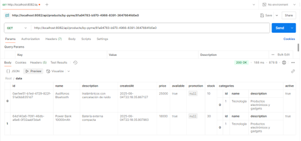


---

### Caso 2: Despublicar un producto existente
| Campo              | Valor                                                                           |
|--------------------|---------------------------------------------------------------------------------|
| **Nombre del Caso**| Despublicar producto (`/unpublish/{productId}`)                                 |
| **Método HTTP**    | `PUT`                                                                           |
| **Endpoint**       | `/unpublish/{productId}`                                                        |
| **URL completa**   | `http://localhost:8082/api/products/unpublish/0ae1ee51-b1ed-4729-822f-51a0bb8351d7` |
| **Criterio de éxito**| Código **200 OK** y campo `is_active=false` o `available=false`               |

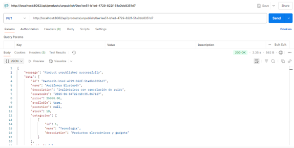
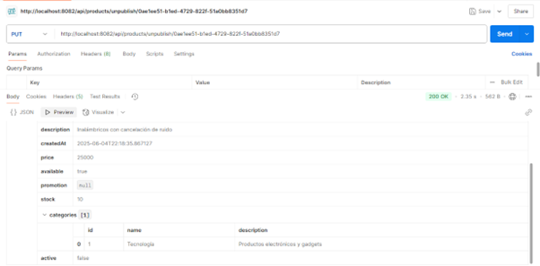

---

### Caso 3: Actualizar el stock y disponibilidad de un producto
| Campo              | Valor                                                                           |
|--------------------|---------------------------------------------------------------------------------|
| **Nombre del Caso**| Actualizar stock y disponibilidad                                               |
| **Método HTTP**    | `PUT`                                                                           |
| **Endpoint**       | `/update-stock/{productId}`                                                     |
| **URL completa**   | `http://localhost:8082/api/products/update-stock/0ae1ee51-b1ed-4729-822f-51a0bb8351d7` |
| **Body (JSON)**    | ```json\n{ "stock": 15, "available": true }\n```                                |
| **Criterio de éxito**| Código **200 OK** y producto con `stock = 15`                                 |

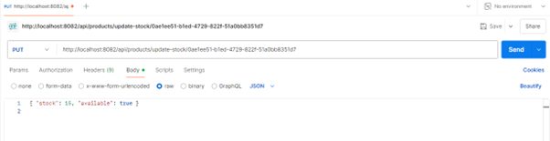
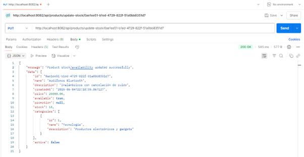

---

### Caso 4: Pyme no encontrada
| Campo              | Valor                                                                           |
|--------------------|---------------------------------------------------------------------------------|
| **Nombre del Caso**| Obtener productos de una Pyme inexistente                                       |
| **Método HTTP**    | `GET`                                                                           |
| **Endpoint**       | `/by-pyme/{pymeId}`                                                             |
| **URL completa**   | `http://localhost:8082/api/products/by-pyme/00000000`                           |
| **Criterio de éxito**| Código de error personalizado **400** y mensaje `"Pyme not found"`           |

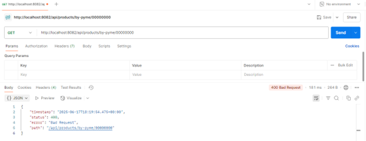

---

### Caso 5: Crear un nuevo producto
| Campo              | Valor                                                                           |
|--------------------|---------------------------------------------------------------------------------|
| **Nombre del Caso**| Crear producto nuevo                                                            |
| **Método HTTP**    | `POST`                                                                          |
| **Endpoint**       | (raíz)                                                                          |
| **URL completa**   | `http://localhost:8082/api/products`                                            |
| **Body (JSON)**    | ```json\n{\n  "name": "Mouse Gamer",\n  "description": "Mouse con luces RGB y 7 botones",\n  "price": 18000.00,\n  "category": ["1"],\n  "images": ["https://mipagina.com/mouse1.jpg"],\n  "available": true,\n  "promotion": "0",\n  "stock": 25,\n  "pymeId": "81a94783-b970-4966-8391-3647664fd0e0"\n}\n``` |
| **Criterio de éxito**| Código **200 OK** y respuesta con datos del producto creado                    |

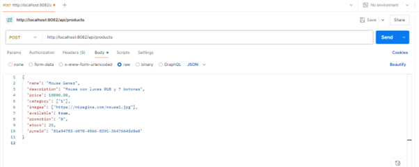
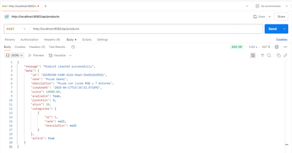

---

### Caso 6: Actualizar solo disponibilidad del producto
| Campo              | Valor                                                                           |
|--------------------|---------------------------------------------------------------------------------|
| **Nombre del Caso**| Cambiar solo `available` a `false`                                              |
| **Método HTTP**    | `PUT`                                                                           |
| **URL completa**   | `http://localhost:8082/api/products/update-stock/64d140a6-7091-46db-a6e6-0f32aabf3da4` |
| **Body (JSON)**    | ```json\n{ "available": false }\n```                                            |
| **Criterio de éxito**| Código **200 OK** y `available = false` en la respuesta                       |

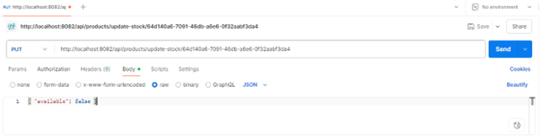
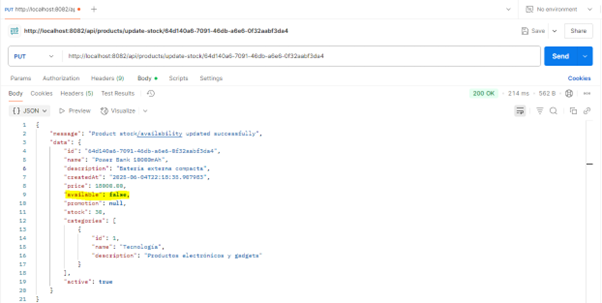


---

### Caso 7: Actualizar solo el stock
| Campo              | Valor                                                                           |
|--------------------|---------------------------------------------------------------------------------|
| **Nombre del Caso**| Cambiar el número de inventario (`stock`)                                       |
| **Método HTTP**    | `PUT`                                                                           |
| **URL completa**   | `http://localhost:8082/api/products/update-stock/64d140a6-7091-46db-a6e6-0f32aabf3da4` |
| **Body (JSON)**    | ```json\n{ "stock": 5 }\n```                                                    |
| **Criterio de éxito**| Código **200 OK** y `stock = 5` en la respuesta                                |

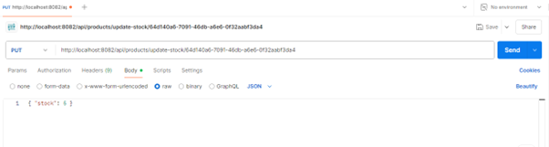
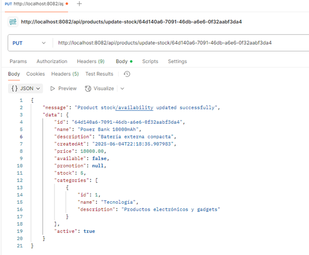

---

### Caso 8: Actualizar producto inexistente
| Campo              | Valor                                                                           |
|--------------------|---------------------------------------------------------------------------------|
| **Nombre del Caso**| Error al actualizar producto inexistente                                        |
| **Método HTTP**    | `PUT`                                                                           |
| **URL completa**   | `http://localhost:8082/api/products/update-stock/00000000`                      |
| **Body (JSON)**    | ```json\n{ "stock": 10, "available": true }\n```                                |
| **Criterio de éxito**| Código de error personalizado **400** y mensaje `"Pyme not found"`           |

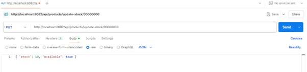
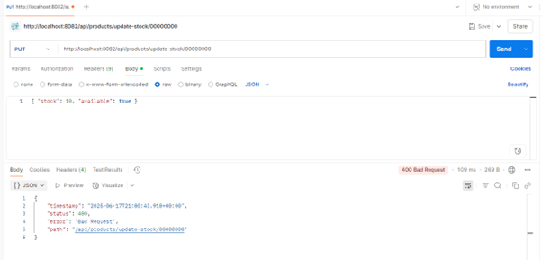


Documento elaborado por: Sofía Mora Badilla
Fecha de elaboración: 26/06/2025