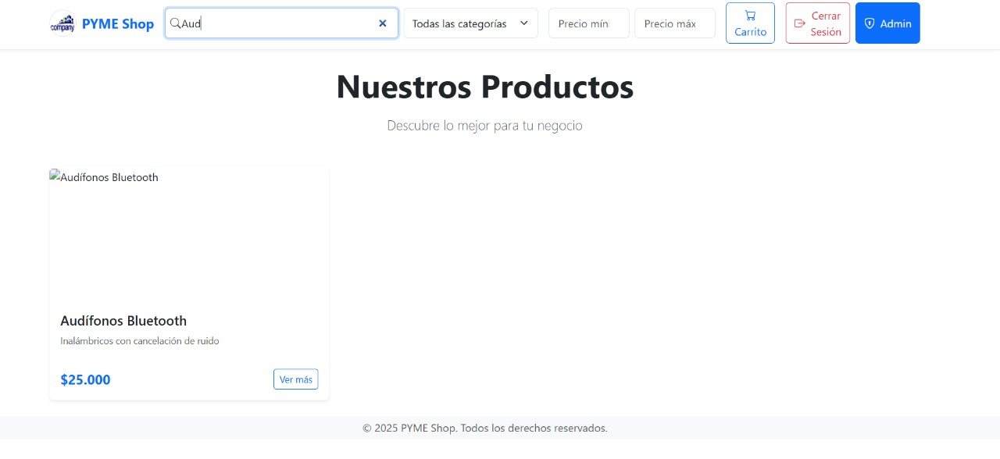
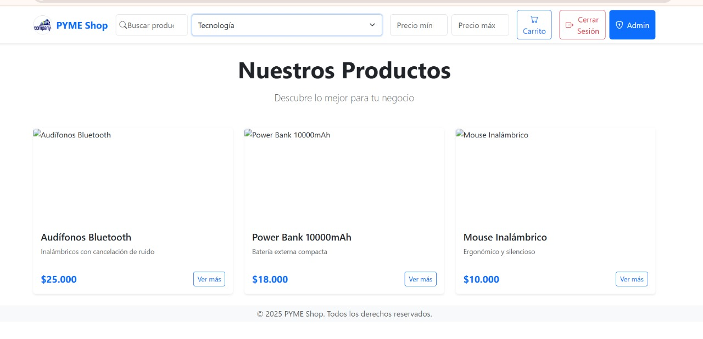
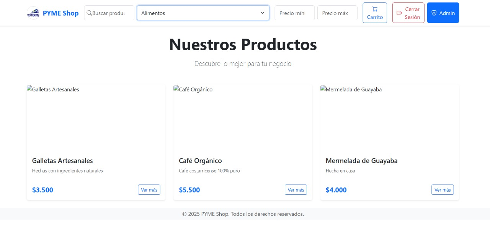

# Documento de Pruebas Manuales - Localizar Productos (Frontend)

## 1. Descripción General

Este documento detalla las pruebas manuales realizadas en la interfaz de usuario de la plataforma PYME Shop, específicamente para la funcionalidad de localización de productos mediante búsqueda, filtrado y visualización dinámica.

---

## 2. Escenarios de Prueba Cubiertos

1. El campo de búsqueda es visible en las páginas relevantes para compradores registrados o anónimos.
2. Al ingresar texto en el campo de búsqueda, se actualizan los resultados dinámicamente sin recargar la página.
3. El sistema muestra sugerencias o autocompletado conforme se escribe en el campo de búsqueda.
4. Se puede seleccionar una o más categorías desde filtros disponibles para refinar los resultados mostrados.
5. Se permite filtrar productos por rango de precio desde un control deslizante o campos numéricos.
6. Se pueden aplicar filtros de disponibilidad (por ejemplo: solo productos en stock).
7. Se muestra un mensaje adecuado cuando no hay productos que coincidan con la búsqueda o filtros aplicados.
8. La interfaz es responsiva y funcional en dispositivos móviles y escritorio.

---

## 3. Evidencia Visual por Escenario

### Escenario 1: Campo de búsqueda visible

**Resultado esperado:** El input de búsqueda es visible y permite interacción.

---

### Escenario 2: Resultados dinámicos por texto

**Acción:** Se escribe "Aud" en el campo de búsqueda.

**Resultado esperado:** Aparece el producto "Audífonos Bluetooth" sin necesidad de recargar la página.

---

### Escenario 3: Filtrar por categoría - Tecnología

**Acción:** Se selecciona la categoría "Tecnología".

**Resultado esperado:** Se muestran solo productos tecnológicos.

---

### Escenario 4: Filtrar por categoría - Alimentos

**Acción:** Se selecciona la categoría "Alimentos".

**Resultado esperado:** Se muestran productos como galletas artesanales, café y mermeladas.

---

## 4. Conclusión

Las pruebas manuales realizadas demuestran que el sistema de localización de productos en la plataforma cumple con los criterios funcionales definidos, presentando una interfaz intuitiva y adaptable, además de mostrar resultados precisos y en tiempo real.

**Documento elaborado por:** Luis Daniel Solano Solano
**Fecha:** 26/06/2025
