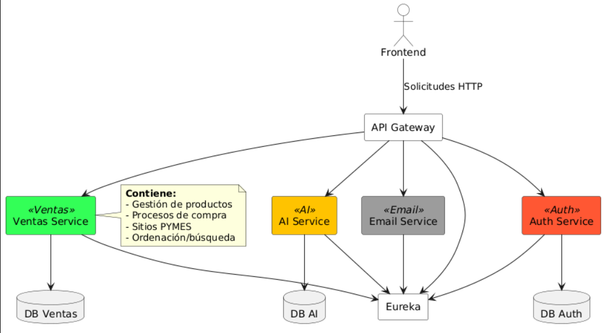

# Arquitectura de Microservicios

La siguiente representación describe la arquitectura de microservicios de un sistema de comercio electrónico para PYMES. Esta arquitectura permite a las PYMES registrarse, publicar productos, gestionar inventarios y realizar ventas a través de la plataforma. A continuación se detallan los componentes clave de la plataforma:

## Diagrama de la Arquitectura



```plantuml
@startuml
skinparam componentStyle rectangle

' Colores personalizados
!define AUTH_COLOR #FF5733  
!define EMAIL_COLOR #9C9C9C  
!define VENTAS_COLOR #33FF57 
!define AI_COLOR #FFC300  

' Componentes
actor "Frontend" as Frontend #White
component "API Gateway" as Gateway #White
component "Eureka" as Eureka #White

' Microservicios
component "Auth Service" as Auth <<Auth>> AUTH_COLOR
component "Email Service" as Email <<Email>> EMAIL_COLOR
component "Ventas Service" as Ventas <<Ventas>> VENTAS_COLOR
component "AI Service" as AI <<AI>> AI_COLOR  ' Este servicio es el chatbot conectado a una API como Copilot

' Bases de datos
database "DB Auth" as DBAuth
database "DB Ventas" as DBVentas
database "DB AI" as DBAI

' Conexiones
Frontend --> Gateway : Solicitudes HTTP
Gateway --> Auth
Gateway --> Email
Gateway --> Ventas
Gateway --> AI

' Service Discovery
Auth --> Eureka
Email --> Eureka
Ventas --> Eureka
AI --> Eureka
Gateway --> Eureka

' Persistencia
Auth --> DBAuth
Ventas --> DBVentas
AI --> DBAI

note right of Ventas
  **Contiene:**
  - Gestión de productos
  - Procesos de compra
  - Sitios PYMES
  - Ordenación/búsqueda
end note
@enduml
```

## Descripción de cada componente:

### **Frontend:**
- El componente frontal de la plataforma, donde los usuarios interactúan con la plataforma de comercio electrónico.
- A través de este componente, las PYMES pueden publicar productos, gestionar su tienda y visualizar ventas, mientras que los compradores exploran productos y hacen compras.

### **API Gateway:**
- El **API Gateway** actúa como un punto de entrada centralizado para todas las solicitudes del frontend, redirigiéndolas a los microservicios correspondientes como **Auth**, **Email**, **Ventas**, y **AI**.
- Asegura la comunicación eficiente y organizada entre los diferentes microservicios.

### **Eureka:**
- **Eureka** es el servicio de descubrimiento de microservicios que permite a los microservicios encontrar y comunicarse entre sí dinámicamente.
- Cada microservicio se registra en Eureka al inicio, lo que facilita la gestión de los mismos.

### **Auth Service:**
- El **Auth Service** es responsable de la autenticación y validación de las PYMES y compradores en la plataforma.
- Permite a las PYMES registrarse y gestionar su cuenta, asegurando la seguridad de los datos.

### **Email Service:**
- Este servicio gestiona el envío de correos electrónicos tanto para las PYMES como para los compradores.
- Entre sus funciones están el envío de correos de confirmación de registro, notificaciones de compra, y promociones.

### **Ventas Service:**
- **Ventas Service** se encarga de la gestión de productos, procesamiento de compras, y el control de inventarios para cada Pyme.
- Permite a las PYMES gestionar y mostrar su catálogo de productos, e incluso ajustar precios, stock, y promociones.

### **AI Service (Chatbot):**
- Este componente está destinado a proporcionar asistencia automatizada a las PYMES y compradores mediante un chatbot.
- Se conectará con APIs externas como Copilot o tecnologías similares para ofrecer respuestas inteligentes sobre productos, procesos de compra, y resolución de problemas frecuentes.

**Versión:** 1.0  
**Fecha de creación:** 30-04-2025  
**Úñtima actualización:** 1-05-2025  
**Documento Preparado Por:** Mariano Duran Artavia


